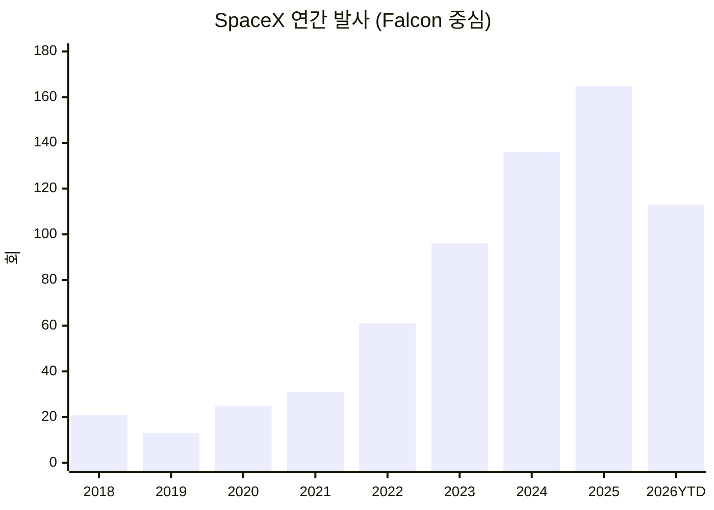
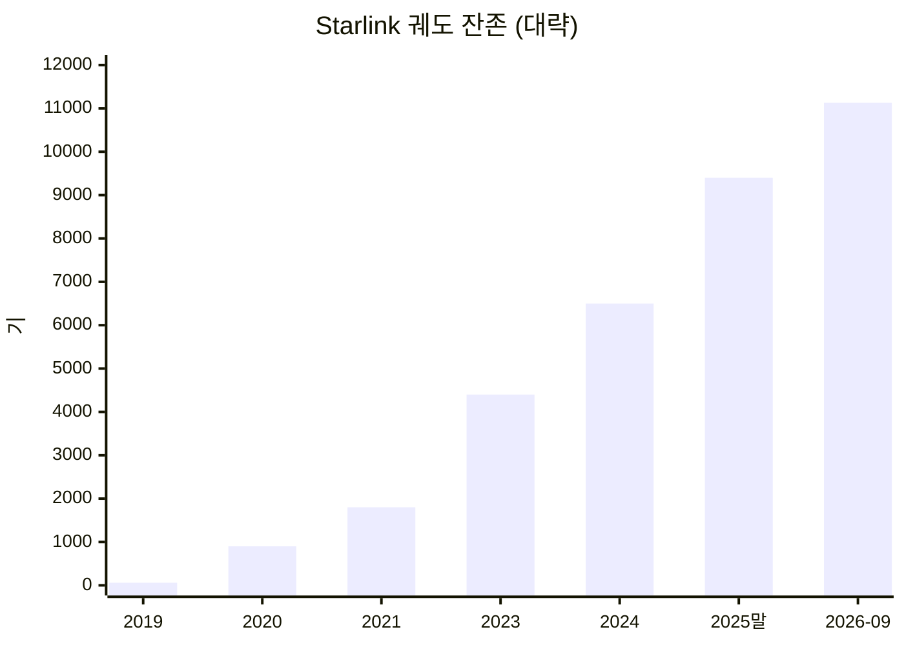
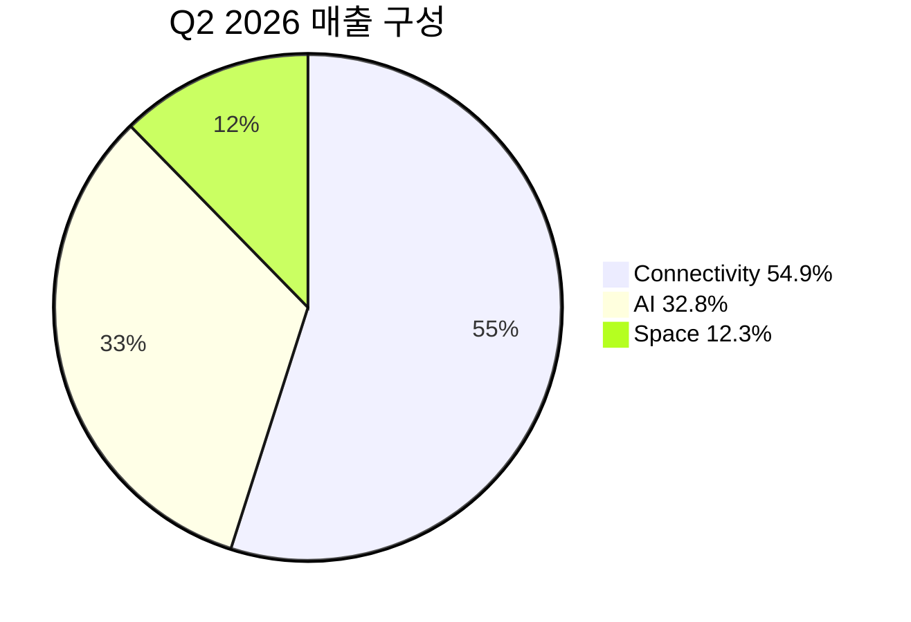
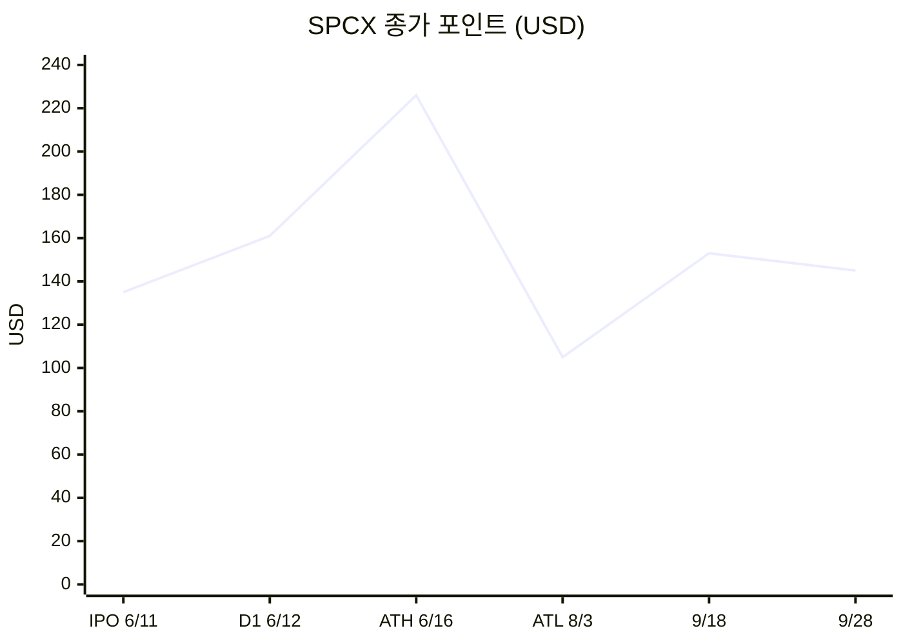

# SpaceX 데이터셋 (2002-03-14 ~ 2026-09-29)

> 스냅샷: **2026-09-29 KST**. 출처가 다른 집계는 범위로 병기. 단위는 명시된 그대로.  
> 용도: 보고서가 아니라 **표·시계열·KPI를 그대로 재사용**할 수 있는 데이터 노트.

---

## 0. 엔티티 키

| 필드 | 값 |
|---|---|
| 법인명 | Space Exploration Technologies Corp. |
| 티커 | NASDAQ: **SPCX** (Class A) |
| ISIN | US84615Q1031 |
| 설립 | 2002-03-14 (El Segundo, CA) |
| 현재 HQ | Starbase, Texas, USA |
| 창업자 / CEO·CTO·Chairman | Elon Musk |
| President & COO | Gwynne Shotwell |
| 상장일 | 2026-06-12 |
| 직원 수 | >22,000 (2026-03-31) |
| 주요 자회사/통합 | Starlink, Starshield, xAI / X (2026-02-02 인수 반영) |

---

## 1. 회사 마일스톤 (연표)

| 날짜 | 이벤트 | 수치/비고 |
|---|---|---|
| 2002-03-14 | 설립. Musk PayPal 지분 매각금 중 약 $100M 투입 | 초기 자본 |
| 2006-03 | Falcon 1 첫 발사 실패 | 이후 3연속 실패 |
| 2008-09-28 | Falcon 1 궤도 성공. 민간 액체연료 로켓 최초 궤도 | 4번째 시도 |
| 2008-12 | NASA CRS $1.6B (화물 12회) | 파산 직전 구원 계약 |
| 2010-06-04 | Falcon 9 첫 비행 | |
| 2012-05 | Dragon 화물, ISS 도킹 (민간 최초) | CRS-1 부분실패(2차 페이로드) |
| 2015-12 | Falcon 9 1단 지상 착륙 성공 | |
| 2016-04 | 해상 드론십 착륙 | |
| 2017 | 비행 이력 부스터 재비행 | |
| 2018-02-06 | Falcon Heavy 첫 비행 | Tesla Roadster |
| 2019-05-24 | Starlink 첫 대량 배치 (60기) | |
| 2020-05 | Crew Dragon Demo-2. 미국 유인 궤도 재개 | |
| 2023-04-20 | Starship 통합비행 1 | |
| 2024-10 | Super Heavy 타워 캐치 | |
| 2025 | 연간 궤도발사 165~170회. 세계 궤도질량 ~80%+ | |
| 2026-02-02 | xAI Holdings 인수 완료 | AI 세그먼트 분리 공시 |
| 2026-05-20 | S-1 제출 | |
| 2026-06-11 | IPO 가격 $135 | 기업가치 ~$1.77T |
| 2026-06-12 | Nasdaq 상장. 종가 $160.95 | 시총 ~$2.1T. 조달 $75B → 그린슈 포함 **$85.7B** |
| 2026-06-30 | Starlink 구독 12.0M | Q2 실적 |
| 2026-07-24 | Starship Flight 13. V3 20기 서브오비탈 전개 | |
| 2026-09-28 | Starship Flight 14. **최초 궤도 + 운용 V3 26기 전개** | 엔진 1기 조기 종료로 임무 단축, 태평양 스플래시다운 |

---

## 2. 발사 집계 (차량별)

집계 시점·정의(부분실패 포함 여부)에 따라 1~수 회 차이. 아래는 2026-09 말 공개 트래커 합성.

### 2.1 누적 성공률

| 차량 | 시도 | 성공 | 실패/부분 | 성공률 | 비고 |
|---|---:|---:|---:|---:|---|
| Falcon 1 | 5 | 2 | 3 | 40.0% | 퇴역 |
| Falcon 9 (전 변형) | 689~691 | 687~688 | 2~4 | ~99.5–99.6% | Block 5가 대다수 |
| Falcon 9 Block 5 | 633~634 | 632~633 | 1 | ~99.84% | 2018-05~ |
| Falcon Heavy | 13 | 13 | 0 | 100% | |
| Falcon family 합계 | ~707 | ~702 | ~5 | ~99% | KeepTrack 2026-09-29 |
| Starship 통합비행 | 14 | 9~11* | 3~5* | 정의 의존 | Flight 14 = 첫 궤도·운용 페이로드 |

\* 서브오비탈 테스트 vs 궤도 성공 정의가 트래커마다 다름. Flight 14(2026-09-28)는 궤도 투입·26기 V3 전개 성공으로 분류.

### 2.2 연도별 궤도발사 (SpaceX 전체 / Falcon 중심)

| 연도 | Falcon 계열 시도 | Falcon 성공 | Starship 통합비행 | SpaceX 총 궤도/시험 | 세계 궤도발사 대비 점유(대략) |
|---:|---:|---:|---:|---:|---:|
| 2006 | 1 | 0 | 0 | 1 | — |
| 2007 | 1 | 0 | 0 | 1 | — |
| 2008 | 2 | 1 | 0 | 2 | — |
| 2009 | 1 | 1 | 0 | 1 | — |
| 2010 | 2 | 2 | 0 | 2 | — |
| 2012 | 2 | 2 | 0 | 2 | — |
| 2013 | 3 | 3 | 0 | 3 | — |
| 2014 | 6 | 6 | 0 | 6 | — |
| 2015 | 7 | 6 | 0 | 7 | — |
| 2016 | 8~9 | 8 | 0 | 8~9 | — |
| 2017 | 18 | 18 | 0 | 18 | — |
| 2018 | 21 | 21 | 0 | 21 | — |
| 2019 | 13 | 13 | 0 | 13 | — |
| 2020 | 25 | 25 | 0 | 25 | ~22% |
| 2021 | 31 | 31 | 0 | 31 | ~23% |
| 2022 | 61 | 61 | 0 | 61 | ~33% |
| 2023 | 96 | 96 | 2 | 98 | ~46% |
| 2024 | 134~138 | 133~136 | 3~4 | 136~138 | ~51% |
| 2025 | 165 | 165 | 5 | 170 | ~50% (세계 ~330) |
| 2026 YTD (09-29) | 110~113 | 110~113 | 3 (F12–F14) | ~113+ | 세계 YTD 중 약 48% 전후 |

회사 공시 운영지표 (S-1 / 10-Q):

| 지표 | 2023 | 2024 | 2025 | H1 2025 | H1 2026 |
|---|---:|---:|---:|---:|---:|
| 총 발사 | 98 | 138 | 170 | 84 | 78 |
| 중 Falcon | 96 | 134 | 165 | 81 | 77 |
| Falcon 고객 발사 | 33 | 45 | 43 | 21 | 17 |
| Falcon 내부(주로 Starlink) | 63 | 89 | 122 | 60 | 60 |
| Starship 시험 | 2 | 4 | 5 | 3 | 1 (H1; 이후 F13·F14) |
| 궤도 투입 질량 t | 1,210 | 1,699 | 2,213 | 1,102 | 1,041 |
| 고객 페이로드 t | 205 | 282 | 312 | 163 | 132 |
| 내부 페이로드 t | 1,005 | 1,418 | 1,901 | 938 | 908 |

Q2 2026 단독: 발사 38회, 고객 10회, 궤도질량 485 t (고객 87 / 내부 397).



### 2.3 발사 사이트 (누적, SpaceXNow 근사)

| 사이트 | 시도 | 성공률 |
|---|---:|---:|
| Cape Canaveral | 344~346 | ~99.4% |
| Kennedy Space Center (39A) | 127 | 100% |
| Vandenberg | 230~231 | ~99.6% |
| Kwajalein (Falcon 1) | 5 | 40% |
| Starbase (Starship) | 14 | ~57–80% (정의 의존) |

### 2.4 재사용 KPI (Falcon 1단)

| 지표 | 값 (2026-09 말) |
|---|---|
| 1단 착륙 성공 | 661 / 674 시도 (**98.07%**) |
| Block 5 착륙 | 636 / 642 (**99.07%**) |
| 최다 비행 부스터 | **B1067 = 37회** (2026-08-25) |
| 기타 고재사용 | B1071 35+, B1063 35 (최장수 현역), B1069 32 |
| Block 5 부스터 수 | ~39기, 평균 ~16.3회/기 |
| 최단 턴어라운드 | B1088 **9일 3시간 39분 28초** |
| 동일일 최단 간격(다른 로켓) | 38분 31초 (2026-08-16 Globalstar ↔ USSF-366, 사이트 상이) |
| 비행 이력 부스터 발사 | 2025년 159회 / 누적 540회+ (S-1 3/31 기준) |

### 2.5 Starship 통합비행 요약

| Flight | 날짜 | 부스터/쉽 | 결과 한줄 |
|---:|---|---|---|
| 1 | 2023-04-20 | — | 이륙 직후 파괴 |
| 2–6 | 2023–2024 | V1/V2 | 점진적 스테이지 분리·재진입 데이터 |
| 7 | 2025-01-16 | B14 catch | Super Heavy 타워 캐치 |
| 8 | 2025-03-06 | B15 catch | 캐치 후 B15 재비행(F11) |
| 9–11 | 2025 | — | 재비행·재진입 혼재 |
| 12 | 2026-05-22 | B19 / V3 | V3 데뷔. 모의+실 V3. 부스터 부스트백 실패 |
| 13 | 2026-07-24 | B20 / S40 | **운용 V3 20기 전개(서브오비탈)**. 쉽 인도양 소프트 스플래시, 이후 회수 |
| 14 | 2026-09-28 | B21 / S41 | **첫 궤도 + V3 26기 운용 궤도 전개**. RVac 1기 조기종료로 단축. 부스터 멕시코만 제어 착수, 쉽 태평양 스플래시(화염) |

---

## 3. 우주선·탐사

### 3.1 Dragon

| 항목 | 값 |
|---|---|
| Cargo Dragon ISS | 2012~ (CRS). 미국 유일 정기 왕복 화물 |
| Crew Dragon | 2020 Demo-2 이후 운용. NASA CCP |
| 2025 ISS 미국 유인·화물 | SpaceX가 **전부** 수행 (회사 공시) |
| 다음 유인 | Crew-13: **2026-10-01** 11:10 ET, SLC-40 |
| 기타 유인 | Ax-시리즈, Polaris Dawn, Fram2 등 민간/고궤도 |

### 3.2 달·화성 프로그램 상태 (2026-09)

| 프로그램 | 상태 |
|---|---|
| NASA Artemis HLS | Starship이 착륙선. Artemis III는 지구궤도 도킹 시험으로 재정의(목표 2027 말), **유인 착륙은 Artemis IV ~2028 초**로 밀림 |
| 달 기지 | 2026-02 Musk: 10년 내 self-growing city 우선 발언 |
| 화성 | Starship 완전재사용·대규모 추진제 전송 미완. 궤도 추진제 전송 ~5 t 실증(시험) |
| Starfall | FAA 프로토타입 재진입 시험 2회 승인. 1회 완료(2026-06-23), 2회 미실시(2026-08 기준) |

### 3.3 차량 스펙 (참고)

| 차량 | 높이 | LEO 페이로드 | 재사용 | 상태 |
|---|---|---:|---|---|
| Falcon 9 Block 5 | 70 m | ~22,800 kg | 1단+페어링 | 운용 |
| Falcon Heavy | 70 m | ~63,800 kg | 측면 부스터 | 운용 |
| Starship | 121 m | 설계 ~100–150 t | 양단 (개발) | 시험·초기 운용 페이로드 |

리스트 가격 참고: Falcon 9 상용 ~$74M (2026-03 인상). 완전소모 LEO kg당 ~$3,360 단순계산.

---

## 4. Starlink

### 4.1 위성 재고 (독립 추적, Jonathan McDowell / CelesTrak)

| 지표 | 값 | 기준일 |
|---|---:|---|
| 누적 발사 | **12,935** | 2026-09-10 |
| 궤도 잔존 | **11,133** | 2026-09-10 |
| 작동(working) | **11,112 ~ 11,118** | 2026-09-13/15 |
| 운용 쉘 배치 | 9,713 | 2026-09-10 |
| 재진입·폐기 | ~1,800+ | 누적 |
| Gen1 궤도 | ~3,173–3,190 | |
| Gen2 궤도 | ~7,939–7,943 | DTC ~639 포함 |
| V3 | F13: 20기 서브오비탈 데모 / **F14: 26기 운용 궤도** (2026-09-28) | |

회사 공시(2026-03-31): 광대역+모바일 ~9,600기. 2026-06-30 콜: 콘스텔레이션 ~10,200기, 광대역 9,600기, 다운링크 용량 ~800 Tbps(명목).



### 4.2 가입·커버리지

| 시점 | 구독(서비스 라인) | 국가/시장 | ARPU $/월 |
|---|---:|---:|---:|
| 2020 | <10k | 베타 | — |
| 2021 | ~145k | — | — |
| 2022 | ~1.0M | — | — |
| 2023 | ~2.3M | — | ~99 |
| 2024 말 | ~4.6M | — | — |
| 2025 Q2 | 6.0M | — | 85 |
| 2026-03-31 | 10.3M | 164 | 66 |
| 2026-06-04 | 12.0M 돌파 | 160+ | — |
| 2026-06-30 | **12.0M** | 167 | **66** |

Q2 2026 순증 ~1.7M (Q1 ~1.4M). 내부 목표 언급: 2026 말 ~25M.

성능 공시: 다운로드 400 Mbps+, RTT 최저 ~21 ms. V3 설계 다운링크 **1,024 Gbps/기** (V2 Mini 96 Gbps).

### 4.3 Starlink / Connectivity 매출

| 기간 | Connectivity 매출 $M | Consumer | Ent+Gov | 영업이익 $M | Adj. EBITDA $M |
|---|---:|---:|---:|---:|---:|
| FY2023 | 3,869 | 2,817 | 1,052 | — | — |
| FY2024 | 7,599 | 4,830 | 2,769 | — | — |
| FY2025 | **11,387** | 7,208 | 4,179 | — | 7,170 |
| Q2 2025 | 2,588 | 1,721 | — | 923 | — |
| Q1 2026 | 3,257 | 2,148 | 1,109 | 1,188 | — |
| Q2 2026 | **4,291** | 2,485 | 1,806 | **1,656** | **2,597** |
| H1 2026 | 7,548 | — | — | 2,844 | 4,680 |

Q2 2026 Connectivity 영업마진 38.6%, Adj. EBITDA 마진 60.5%.  
Starshield 미국 정부 다년 계약 **$6B+** 공시.

---

## 5. 연결 재무

xAI/X 인수 후 3세그먼트: **Space / Connectivity / AI**.

### 5.1 연간

| $M | FY2023 | FY2024 | FY2025 |
|---|---:|---:|---:|
| 매출 | 10,387 | 14,015 | **18,674** |
| Space | 3,557 | 3,796 | 4,086 |
|  └ Launch Services | 1,964 | 2,584 | 2,576 |
|  └ Launch & Development | 1,593 | 1,212 | 1,510 |
| Connectivity | 3,869 | 7,599 | 11,387 |
| AI | 2,961 | 2,620 | 3,201 |
|  └ Advertising (X) | 2,323 | 1,728 | 1,844 |
|  └ AI Solutions & Infra | 638 | 892 | 1,357 |
| 영업이익 | −3,500 | +466~500 | **−2,589** |
| 순이익 | −4,600 | +791 | **−4,937** |
| 영업CF | 4,500 | 5,800 | 6,800 |
| Capex | 4,400 | 11,200 | 20,700 |
| FCF | +100 | −5,400 | −14,000 |
| R&D | — | — | 8,643 (+149.5% YoY) |

FY2025 매출 구성: Connectivity **61.0%**, Space 21.9%, AI 17.1%.

### 5.2 분기

| $M | Q2 2025 | Q1 2026 | Q2 2026 | H1 2026 |
|---|---:|---:|---:|---:|
| 매출 | 4,071 | 4,694 | **7,814** | 12,508 |
| Space | 746 | 619 | 962 | 1,581 |
| Connectivity | 2,588 | 3,257 | 4,291 | 7,548 |
| AI | 737 | 818 | 2,561 | 3,379 |
| 영업이익 | −970 | −1,943 | **−143** | −2,086 |
| 순이익 | −1,008 | −4,276 | **−541** | — |
| Adj. EBITDA | 1,214 | 1,127 | **3,538** | — |
| Capex | 2,825 | 10,107 | **18,369** | ~28,500 |
|  └ AI capex | 749 | 7,723 | **15,828** | — |
| 현금 | — | 15,850 | **93,520** | IPO 자금 포함 |

Q2 2026 매출 +92% YoY. TTM 매출 ~$23.0–23.1B.  
수주잔고(계약, 미인도) **$47.5B** (2026-06).  
클라우드 서비스 약정 $14.1B 중 Q2 인식 $1.6B.



---

## 6. 밸류에이션 · IPO · 주가

### 6.1 비상장 라운드 / 텐더 (대략)

| 시점 | 이벤트 | 조달 | 포스트머니 |
|---|---|---|---|
| 2015 | Google+Fidelity | $1.0B | $10–12B |
| 2017 | Series H | $0.35–0.45B | ~$21B |
| 2020 | Series J | $1.9B | ~$46B |
| 2021 | | $1.2–1.6B | ~$74B |
| 2024-12 | 내부 텐더 | — | ~$350B |
| 2025-07 | 내부 텐더 | — | ~$400B ($212/주 계열) |
| 2025-12 | 내부 텐더 | — | ~$800B ($421/주 계열) |
| 2026-06-11 | IPO 프라이싱 | $75.0B (555.56M주 × $135) | **$1.77T** |
| 2026-06-15 | 그린슈 행사 포함 클로징 | **$85.7B** (638.89M주) | — |

IPO 구조:

| 항목 | 값 |
|---|---|
| 거래소 | Nasdaq GS + Nasdaq Texas 이중상장 |
| 티커 | SPCX |
| 발행 Class A | 555,555,555 + 그린슈 83,333,333 |
| 기관:리테일 | 70:30 |
| 유통비율 | ~5% |
| 주관 | Goldman Sachs, Morgan Stanley 등 |
| Musk 의결권 | ~82–85% (슈퍼보팅) |
| 지분 | ~39–42% (옵션 포함 공시 버전 상이) |
| 락업 | Musk·내부자 366일 |

### 6.2 상장 후 주가 포인트

| 날짜 | 이벤트 | 종가 USD | 시총 함의 |
|---|---|---:|---|
| 2026-06-11 | IPO 가격 | 135.00 | $1.77T |
| 2026-06-12 | 첫날. 시가 $150, 거래 ~5.1억주 | **160.95** | ~$2.10–2.11T |
| 2026-06-16 | 신고가 | **225.64** | 피크 |
| 2026-06-30 | | ~172.40 (3개월 고점권) | |
| 2026-08-03 | 상장 후 저점 | **104.83** | |
| 2026-09-18 | | 152.71 | |
| 2026-09-28 | 정규장 종가 (Flight 14 당일) | **145.47** | ~$1.92–1.97T |

정규장 2026-09-28 세부:

| 항목 | 값 |
|---|---|
| Open / High / Low / Close | 148.49 / 150.80 / 145.36 / **145.47** |
| 전일대비 | −3.21 (−2.16%) |
| 거래량 | ~81.6–83.5M (평균 ~92–93M) |
| 52주(상장 이후) | 104.83 – 225.64 |
| vs IPO $135 | **+7.76%** |
| vs 첫날 종가 $160.95 | **−9.62%** |
| 상장 후 실현변동성(연율) | ~87% |
| 발행주식 | ~13.08–13.57B (클래스·희석 정의 의존) |
| TTM P/S | ~65–87× (시점·시총 정의 의존) |
| Forward PE | ~100.5 (컨센서스, 적자 구간) |
| 애널리스트 목표가 평균 | ~$222 (Buy) |



월별 대략 등락 (상장 이후):

| 월 | High | Low | 월간 방향 |
|---|---:|---:|---|
| 2026-06 | 225.64 | 135.00 | 상장+급등 |
| 2026-07 | 171.70 | 107.00 | −36.6% 전후 |
| 2026-08 | 149.80 | 104.83 | +32.6% 전후 (바닥 반등) |
| 2026-09 | 158.13 | 138.17 | +1.2% 전후 |

일별 최근 세션 (정규 종가):

| Date | Open | High | Low | Close | Vol(대략) |
|---|---:|---:|---:|---:|---:|
| 2026-09-02 | 142.68 | 143.10 | 138.17 | 140.71 | 50M |
| 2026-09-03 | 141.36 | 152.30 | 141.05 | 149.74 | 121M |
| 2026-09-08 | 149.05 | 155.00 | 145.14 | 153.47 | 86M |
| 2026-09-16 | 144.88 | 153.01 | 144.36 | 150.88 | 109M |
| 2026-09-18 | 154.60 | 156.60 | 149.93 | 152.71 | 336M |
| 2026-09-21 | 154.77 | 158.13 | 151.60 | 151.85 | 82M |
| 2026-09-22 | 151.70 | 154.94 | 150.55 | 154.72 | 59M |
| 2026-09-23 | 153.28 | 154.26 | 147.89 | 148.36 | 61M |
| 2026-09-24 | 148.20 | 149.00 | 145.88 | 148.03 | 73M |
| 2026-09-25 | 148.38 | 149.67 | 146.00 | 148.68 | 55M |
| 2026-09-28 | 148.49 | 150.80 | 145.36 | 145.47 | 82M |

---

## 7. 머신리더블 KPI 한 줄 (2026-09-29 스냅샷)

```
company=SpaceX
ticker=SPCX
founded=2002-03-14
ipo_date=2026-06-12
ipo_price_usd=135
ipo_proceeds_bn=85.7
ipo_valuation_tn=1.77
first_close_usd=160.95
ath_usd=225.64
ath_date=2026-06-16
atl_postipo_usd=104.83
atl_date=2026-08-03
last_close_usd=145.47
last_close_date=2026-09-28
mktcap_tn_approx=1.95
employees=22000
fy2025_rev_bn=18.674
fy2025_ni_bn=-4.937
q2_2026_rev_bn=7.814
q2_2026_ni_bn=-0.541
q2_2026_capex_bn=18.369
h1_2026_rev_bn=12.508
starlink_subs_m=12.0
starlink_subs_date=2026-06-30
starlink_arpu_usd=66
starlink_launched=12935
starlink_in_orbit=11133
starlink_working=11118
falcon9_flights_approx=689
falcon9_success_rate=0.9957
falcon_heavy_flights=13
starship_ift=14
starship_first_orbit=2026-09-28
booster_record_flights=37
booster_id=B1067
landing_success=661/674
fy2025_launches=170
fy2025_mass_t=2213
```

---

## 8. 출처 우선순위 (재현용)

1. SpaceX S-1 / 10-Q / Q2 2026 earnings (SEC, ir.spacex.com) — 재무·구독·발사 운영지표  
2. Nasdaq / Reuters / 회사 보도자료 — IPO $85.7B, $135, 첫날 $160.95  
3. Yahoo Finance / MarketWatch / StockAnalysis — 2026-09-28 종가 $145.47  
4. Jonathan McDowell planet4589.org, CelesTrak — Starlink 기체 수  
5. Wikipedia List of Falcon 9/Heavy, List of Starship launches, SpaceXNow, KeepTrack — 발사·재사용  
6. Spaceflight Now / NASASpaceFlight / CNN Flight 14 라이브 — 2026-09-28 궤도·26기 전개  

수치 충돌 시 **회사 공시 > 독립 궤도 카탈로그 > 언론 2차 집계** 순.
