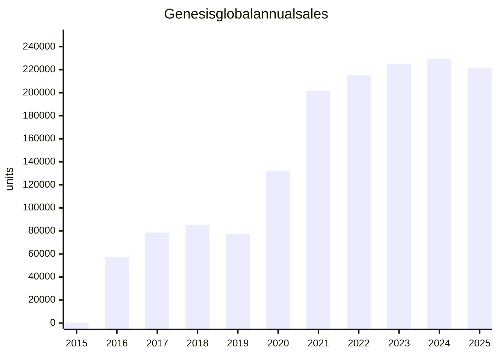

# Genesis Brand Dataset

> 용도: 보고서가 아니라 **데이터셋/차트/대시보드 입력용** 단일 MD.  
> 기준일: 2026-09-29. 수치는 공식·준공식 보도(현대차그룹, 연합뉴스, 전자신문)와 Wikipedia/CarFigures/GCBC를 교차한 것.  
> 단위: 대수(units), 별도 표기 없으면 글로벌 소매/출고 기준.  
> 주의: 미국 연간 수치는 출처마다 수백~수천 대 차이. 모델별 2024 글로벌은 Wikipedia 「List of Genesis vehicles」 표. GV80와 GV80 Coupe 2024 판매는 동일 셀(68,026)로 합산 표기되어 있어 분리하지 않음.

---

## 0. 식별자

| field | value |
|---|---|
| brand | Genesis |
| ko | 제네시스 |
| owner | Hyundai Motor Company (Hyundai Motor Group) |
| type | luxury marque (2015-11-04 독립 브랜드 선언) |
| first_production_model | EQ900 / G90 (2015-12 KR) |
| hq_design | Namyang / Rüsselsheim / Irvine |
| assembly_primary | Ulsan, South Korea |
| na_assembly_note | GV70·Electrified GV70 일부 HMMA(Alabama). 2027MY부터 북미 Genesis 생산은 한국으로 집중 계획(보도) |
| carbon_neutrality_target | 2035 |
| ev_policy_original | 2025년 이후 모든 신차 EV(배터리 또는 FCEV) — 2021-09 발표 |
| ev_policy_revised | 2024-08 하이브리드 병행으로 수정. 2026-09 GV80 하이브리드가 브랜드 첫 HEV |

---

## 1. 연혁 이벤트 (timeline)

| date | event | note |
|---|---|---|
| 1986 | Hyundai Grandeur 출시 | 국내 고급 세단 시도 1 |
| 1996 | Hyundai Dynasty | 그랜저 상위 |
| 1999 | Equus 1세대 (KR) | 플래그십 |
| 2003 | Concept Genesis | RWD V8 스포츠 세단 콘셉트 |
| 2004 | 전담 개발팀 | 럭셔리 프로그램 본격화 |
| 2008 | Hyundai Genesis 세단 (BH) 양산 | 개발비 약 $500M / 내구 테스트 80만 마일. 2009 NA Car of the Year |
| 2009 | Hyundai Genesis Coupe | RWD 스포츠 쿠페. 튜닝·드리프트 문화 |
| 2010-11 | Equus 2세대 북미 출시 | 미국 연 3~4천 대 수준 |
| 2013 | Genesis 세단 2세대 (DH) | 이후 G80 1세대로 이관 |
| 2015-11-04 | Genesis 독립 브랜드 발표 | 한국 최초 전용 럭셔리 브랜드 |
| 2015-12 | EQ900 (글로벌 G90, HI) | 브랜드 첫 양산 |
| 2016 | G80 (DH 리배지) / 미국·중동 진출 | US 2016: 6,948대 |
| 2017 | G70 (IK) | 엔트리 스포츠 세단 |
| 2018 | G90 2세대 / G70 미국 | |
| 2020-01 | GV80 (JX1) | 브랜드 첫 SUV. 판매 변곡점 |
| 2020-03 | G80 3세대 (RG3) | |
| 2020-12 | GV70 (JK1) | |
| 2021-04 | Electrified G80 | 첫 양산 BEV |
| 2021-05 | 유럽 판매 개시 (UK/DE/CH 등) | |
| 2021-08/09 | GV60 (JW, E-GMP) | 전용 EV 플랫폼 첫 모델 |
| 2021-09 | 전동화 비전 (2025 신차 100% EV, 2035 탄소중립) | 이후 수정 |
| 2022 | Electrified GV70 | Alabama 생산 개시(2023) |
| 2023-08 | 글로벌 누적 100만 대 | KR 691,177 + 해외 318,627 = 1,008,804 (8월 누적) |
| 2023-09 | GV80 페이스리프트 / GV80 Coupe | |
| 2024-03/04 | Magma 고성능 라인 발표 (NY) | |
| 2024 | Neolun 콘셉트 = GV90 선행 | NYIAS / 부산 |
| 2024-08 | 전동화 로드맵 수정 (HEV 병행) | |
| 2024-12-04 | Genesis Magma Racing 창단 (두바이) | WEC 2026, IMSA 목표 2027~ |
| 2025-11 | 누적 글로벌 1,510,368 (11월) / G80 누적 501,517 | 10주년 |
| 2025-11-20 | GV60 Magma 월드 프리미어 (Paul Ricard) | 첫 Magma 양산차 |
| 2026-04 | 한국 누적 1,002,998 (3월 말) | 출범 10년 4개월 |
| 2026-04 | GMR-001 WEC 데뷔 (Imola 6h) | LMDh Hypercar |
| 2026-06 | 르망 24시 완주 | |
| 2026-08-19 | GV90 양산형 공개 | 서울 + San Francisco Palace of Fine Arts |
| 2026-09 | GV90 한국 출시 목표 / GV80 첫 하이브리드 | |

---

## 2. 선행 현대 럭셔리 (브랜드 분리 이전)

미국 시장 기준. Genesis 세단은 쿠페와 합산된 연도가 있음(2009 GoodCarBadCar 주석).

### 2.1 Hyundai Genesis sedan (US)

| year | units |
|---|---:|
| 2008 | 6167 |
| 2009 | 21889 |
| 2010 | 29121 |
| 2011 | 32998 |
| 2012 | 36485 |
| 2013 | 32330 |
| 2014 | 29992 |
| 2015 | 31374 |
| 2016 | 23230 |
| 2017 | 1134 |

합계(2008–2017 US, GCBC): **244,720**

### 2.2 Hyundai Equus (US)

| year | units |
|---|---:|
| 2011 | 3193 |
| 2012 | 3972 |
| 2013 | 3578 |
| 2014 | 3415 |
| 2015 | 2332 |
| 2016 | 1361 |
| 2017 | 20 |

합계: **17,871** (CarFigures). 배지 한계로 플래그십 수요를 못 끌어올림 → 독립 브랜드 논리의 근거.

---

## 3. 양산 라인업 카탈로그

네이밍: `G` = 세단(Grandeur 계보의 글로벌 코드), `GV` = Genesis Vehicle(SUV/CUV). 숫자 = 세그먼트(70 compact / 80 mid / 90 flagship).

| model | code | class | first_sale | platform | powertrains | successor_of | status_2026 |
|---|---|---|---|---|---|---|---|
| G70 | IK | D compact exec sedan | 2017 | rear-drive compact | I4T / V6 / diesel(비미) | — | 판매 중. KR 수요 급감, 후속 개발 중단 보도(2025) |
| G70 Shooting Brake | IK | D wagon | 2021 | same | gas/diesel | — | 유럽 중심 |
| G80 | RG3 (현행) | E mid exec sedan | 2016 (DH→2016 리배지, RG3 2020) | M3 RWD | 2.5T / 3.5TT / diesel / BEV | Hyundai Genesis | 볼륨 세단 |
| Electrified G80 | RG3 EV | E BEV sedan | 2021 | converted ICE | dual-motor ~365 hp, ~87 kWh | — | 미국 2025 철회. 유럽은 개량형 유지 |
| G90 / EQ900 | RS4 (현행) | F full luxury sedan | 2015 | RWD luxury | 3.5TT + e-S/C 등 | Equus | 플래그십 세단. KR명 EQ900(~2019) |
| GV60 | JW | C/D BEV coupe-crossover | 2021 | E-GMP 800V | RWD / AWD / Magma | — | 전용 EV. 2025 페이스리프트 |
| GV70 | JK1 | D compact luxury SUV | 2020 | M3 | 2.5T / 3.5TT / diesel / BEV | — | 2024 글로벌 최다 판매 모델 |
| Electrified GV70 | JK1 EV | D BEV SUV | 2022 | converted ICE | dual-motor 429 hp, 77.4→84 kWh | — | US 생산 일시 중단 후 한국 공급 |
| GV80 | JX1 | E mid luxury SUV | 2020 | M3 | 2.5T / 3.5TT / diesel / HEV(2026) | — | 첫 SUV. 2023 FL |
| GV80 Coupe | JX1C | E coupe-SUV | 2023 | JX1 | 3.5TT 중심 | — | |
| GV90 | JG1 | F BEV full-size SUV | 2026 | eMP / E-GMP 계열 800V | dual-motor AWD | Neolun concept | 2026-08 공개, 2026-09 KR / 2027 EU·US |
| GV60 Magma | JW Magma | D performance BEV | 2026/27 MY | E-GMP N-family | Boost ~641 hp | Ioniq 5 N 파워트레인 계열 | Magma 첫 글로벌 양산 |

### 3.1 2024 글로벌 모델별 판매 (Wikipedia)

| model | units_2024 | share_of_229532 |
|---|---:|---:|
| GV70 | 73564 | 32.0% |
| GV80 + GV80 Coupe | 68026 | 29.6% |
| G80 | 52277 | 22.8% |
| G70 | 15962 | 7.0% |
| G90 | 10111 | 4.4% |
| GV60 | 4286 | 1.9% |
| Electrified GV70 | 4153 | 1.8% |
| Electrified G80 | 767 | 0.3% |
| **sum listed** | **229146** | ~99.8% |

SUV(전동 포함) ≈ 150,029 (65.4%). ICE 세단 중심에서 SUV 볼륨 브랜드로 전환 완료.

---

## 4. 전동화

### 4.1 전략 시계열

| year | policy |
|---|---|
| 2021-09 | 2025~ 모든 신차 EV, 2035 탄소중립 |
| 2021–22 | 전환형 BEV 3종 + 전용 GV60 |
| 2024-08 | HEV 병행으로 후퇴/현실화. 미국 EV 수요 급감이 배경 |
| 2025 | 유럽은 BEV 3종 개량(배터리·항속↑) + Magma EV |
| 2026 | GV90 플래그십 BEV, GV80 첫 하이브리드, GV60 Magma |
| 2035 | 탄소중립 목표 유지(발표 기준) |

### 4.2 BEV 스펙 스케치 (시장·연식에 따라 상이)

| model | battery_kWh | motors | peak_hp | range_note | charge |
|---|---:|---|---:|---|---|
| Electrified G80 | ~87.2 | dual | ~365 | US EPA ~282 mi (단종 전) | 800V 아님(개조) |
| Electrified GV70 | 77.4 → 84 (2026) | dual AWD | 429 | EPA ~236→250–263 mi | |
| GV60 std | ~84 | RWD or dual | ~225–429 | EPA up to ~306 mi (2026) | E-GMP 800V, 10–80% ~18분 |
| GV60 Magma | ~84 | dual + boost | 609–650 / US 641 Boost | 항속은 표준보다 낮음 | 동일 계열 |
| GV90 | 123.5 | dual AWD | ~648–657 hp / 800 Nm | 7인승 ~310 mi / ~500 km (사양 의존) | 800V, 350 kW, 10–80% ~22분 |

### 4.3 EV 판매 현실 (미국, 2026 상반기 보도)

| metric | value |
|---|---|
| US EV 2025 H1 | 2,450 |
| US EV 2026 H1 | 560 (−77.1%) |
| GV60 2026 H1 | 485 (전년 동기 1,192) |
| Electrified GV70 2026 H1 | 71 (전년 1,181) |
| Electrified G80 2026 H1 | 4 (라인업 철회) |

글로벌 2024 BEV 합(GV60+e-G80+e-GV70) = **9,206대, 전체의 4.0%**. 브랜드 이미지와 달리 볼륨은 아직 ICE SUV.

---

## 5. 판매 시계열

### 5.1 글로벌 연간

출처: Wikipedia Genesis Motor sales table (현대차 실적 인용). 2021은 연합 보도 201,415와 35대 차이.

| year | global_units | yoy |
|---|---:|---:|
| 2015 | 384 | — |
| 2016 | 57451 | +14861% |
| 2017 | 78586 | +36.8% |
| 2018 | 85389 | +8.7% |
| 2019 | 77135 | −9.7% |
| 2020 | 132450 | +71.7% |
| 2021 | 201450 | +52.1% |
| 2022 | 215128 | +6.8% |
| 2023 | 225189 | +4.7% |
| 2024 | 229532 | +1.9% |
| 2025 | 221482 | −3.5% |



마일스톤

| milestone | when | units |
|---|---|---:|
| 브랜드 출범 | 2015-11 | 0 |
| 연 10만 | 2020 | 132450 |
| 연 20만 | 2021 | 201450 |
| 누적 50만 | 2021 | — |
| 누적 100만 | 2023-08 | 1008804 |
| 누적 150만 | 2025-11 | 1510368 |
| G80 누적 50만 | 2025-11 | 501517 |

2015–2025 합(연간 표 합산) = **1,524,176**. 11월 누적 1,510,368과 연말 2025 221,482가 맞으려면 월별 컷오프 차이. 대시보드에는 **연간 표 / 누적 보도를 분리 보관**.

### 5.2 한국

완전 연간 시계열은 공식 단일표가 공개되지 않음. 확정 포인트만.

| period | kr_units | source_note |
|---|---:|---|
| 2016 G80 only | 44271 | 전자신문. 브랜드 전체가 아님 |
| 2016–2019 | 연평균 5만+ | 회사 회고 |
| 2020 | 108384 | +90.8% YoY. 첫 연 10만 |
| 2021 | 138757 | 국내 역대 최다 |
| 2022 | 누적 60만 돌파 | 연간 미공개 |
| 2023–2025 | 연평균 12만+ | 회사 회고 |
| 2023-08 누적 | 691177 | 글로벌 100만 시점, 비중 68% |
| 2026-03 누적 | 1002998 | 출범 10년 4개월 |
| 2026-01 추정 국내 누적 | ~980000 | 글로벌 150만 시점 국내 64% |

국내 누적 모델 믹스 (2026-03, n=1,002,998)

| model | units | share |
|---|---:|---:|
| G80 + Electrified G80 | 422589 | 42.1% |
| GV80 | 189485 | 18.9% |
| GV70 + Electrified GV70 | 182131 | 18.2% |
| G90 | 130998 | 13.1% |
| 기타(G70, GV60 등) | 77795 | 7.8% |
| sedan total | — | 61.8% |
| SUV total | — | 38.2% |

한국 G70 국내 연간 (조선비즈, 하락 추세)

| year | kr_g70 |
|---|---:|
| 2018 | 14417 |
| 2019 | 16975 |
| 2020 | 7910 |
| 2021 | 7429 |
| 2022 | 6087 |
| 2023 | 4320 |
| 2024 | 2371 |
| 2025 Jan–Jul | 1069 |

### 5.3 해외 / 수출

| metric | value |
|---|---|
| 2023-08 해외 누적 | 318627 (글로벌의 32%) |
| 2025-02 해외 누적 | 464059 |
| 2025-10 수출 누적 | 477740 (2016~) |
| 해외 비중 2020 | 18.2% |
| 해외 비중 2021 | 31.1% |
| 해외 비중 2022 | 37.2% |
| 해외 비중 2023 | 43.8% |
| 중동(GMEA) | 2020 1078 → 2021 2824 → 2022 4602 → 2023 6700 → 2024 8000 |
| 유럽 | 2021 501 / 2023 3460 / 2024 2660. 아직 수천 대 |
| 진출 시장 | 2025-10 기준 약 20개 주요 시장 |

### 5.4 미국 브랜드 연간

출처가 갈림. A=CarFigures brand page, B=CarBuzz rival table, C=GCBC.

| year | A_carfigures | B_carbuzz | C_gcbc |
|---|---:|---:|---:|
| 2016 | 6948 | 6948 | 6948 |
| 2017 | 20612 | 20612 | 20612 |
| 2018 | 10312 | 9940 | 9940 |
| 2019 | 21238 | 21237 | 21237 |
| 2020 | 16384 | 16384 | 16384 |
| 2021 | 49630 | 49630 | 49630 |
| 2022 | 70816 | 56198 | 56198 |
| 2023 | 65398 | 68798 | 68798 |
| 2024 | 70816 | 75003 | 74930 |
| 2025 | 77666 | 82331 | 80210 |

2022 A와 B/C 괴리 큼(재고·집계 방식 의심). 시계열 분석 시 **B/C를 기본, A는 교차검증**.

미국 경쟁 비교 (CarBuzz, 2025)

| brand | 2016 | 2024 | 2025 |
|---|---:|---:|---:|
| Genesis | 6948 | 75003 | 82331 |
| Infiniti | 137970 | 58070 | 52846 |
| Lincoln | 112470 | 104823 | 196868 |
| Acura | 161360 | 132367 | 133433 |
| Lexus | 331228 | 345669 | 370260 |

2016 대비 Genesis US ≈ 12배. 2024부터 Infiniti 추월.

### 5.5 미국 모델 연간 (CarFigures / GCBC 혼합)

G80 US

| year | units |
|---|---:|
| 2016 | 6166 |
| 2017 | 16214 |
| 2018 | 7663 |
| 2019 | 7095 |
| 2020 | 3359 |
| 2021 | 6031 |
| 2022 | 4194 |
| 2023 | 5340 |
| 2024 | 4155 |
| 2025 | 3849 |

G70 US (GCBC)

| year | units |
|---|---:|
| 2018 | 358 |
| 2019 | 11903 |
| 2020 | 9436 |
| 2021 | 10718 |
| 2022 | 12649 |
| 2023 | 13246 |
| 2024 | 12258 |
| 2025 | 10863 |

G90 US (CarFigures)

| year | units |
|---|---:|
| 2016 | 782 |
| 2017 | 4398 |
| 2018 | 2240 |
| 2019 | 2240 |
| 2020 | 2072 |
| 2021 | 1821 |
| 2022 | 1154 |
| 2023 | 1288 |
| 2024 | 1503 |
| 2025 | 1687 |

GV80 US (GCBC)

| year | units |
|---|---:|
| 2020 | 1517 |
| 2021 | 20325 |
| 2022 | 17521 |
| 2023 | 19697 |
| 2024 | 22980 |
| 2025 | 25244 |

미국도 2021 이후 볼륨 축 = GV70 + GV80.

---

## 6. 시장 구조 요약 (분석용 파생)

| indicator | value |
|---|---|
| 성장 1단계 | 2016–2019 세단 3종, 글로벌 5.7~8.5만, 한국 의존 |
| 성장 2단계 | 2020 SUV 투입 → 13.2만 |
| 성장 3단계 | 2021~ 풀라인+전동화, 연 20만대 고원 |
| 2025 | 소폭 역성장(221,482). 고원 + EV 부진 |
| 국내 의존 | 2023-08 68% → 2026-01 ~64%. 여전히 홈마켓 중심 |
| 미국 역할 | 2위 시장. 2024~7.5만 전후 |
| 유럽 | 존재감 미미(연 2~3천) |
| 제품 믹스 전환 | 2024 글로벌 SUV≈65% |
| 전동화 갭 | 전략은 EV 선도, 실판매 4%(2024) |

```mermaid
xychart-beta
    title US Genesis annual sales (CarBuzz/GCBC series)
    x-axis [2016,2017,2018,2019,2020,2021,2022,2023,2024,2025]
    y-axis "units" 0 --> 90000
    bar [6948,20612,9940,21237,16384,49630,56198,68798,75003,82331]
```

---

## 7. Magma — 로드카 + 모터스포츠

### 7.1 프로그램 정의

| field | value |
|---|---|
| name | Magma (마그마). 로고는 한글 ㅁㄱㅁ |
| role | Luxury High Performance 서브브랜드 + 모터스포츠 |
| announced | 2024-04 NY (고성능 라인) / 2024-12 레이싱팀 |
| first_global_production | GV60 Magma (2025-11-20 공개, 2026–27 판매) |
| limited_predecessor | G80 Magma Special (중동 한정, 소수) |
| design_cues | Magma Orange, 와이드 펜더, 에어로, 퍼포먼스 버킷 |
| roadmap | GV60 이후 SUV·세단 Magma 확대, Magma GT 콘셉트 = 10년 헤리티지 상징 |

### 7.2 GV60 Magma (양산)

| spec | value |
|---|---|
| US MSRP | $69,950 (dest. 별도 시 ~$71,495) |
| power_std | ~609 hp / 740 Nm (출처별 448–478 kW) |
| power_boost | 641 hp / 583 lb-ft (US) 또는 650 hp / 790 Nm |
| 0-100 | 3.4 s |
| 0-200 | 10.9 s |
| v_max | 264 km/h (164 mph) |
| battery | ~84 kWh |
| height | −20 mm vs std |
| wheels | 21-inch forged, 275 mm |
| modes | Sprint / GT / MY + Launch + Boost + drift |
| related | Ioniq 5 N / EV6 GT 파워트레인 패밀리 |

### 7.3 Genesis Magma Racing

| field | value |
|---|---|
| team | Genesis Magma Racing (GMR) |
| base | Le Castellet, France |
| principal | Cyril Abiteboul (Hyundai Motorsport President) |
| sporting | Gabriele Tarquini |
| technical | François-Xavier Demaison / Justin Taylor |
| car | GMR-001 LMDh Hypercar, chassis Oreca |
| engine | V8 (그룹 WRC 4기통 경험 파생 아키텍처, 보도) |
| series_now | FIA WEC 2026~, ELMS(경험 축적용 LMP2 2025) |
| series_plan | IMSA 2027 발표 → 이후 2028 검토 보도도 있음 |
| 2025_prep | IDEC Sport LMP2, Barcelona ELMS 데뷔 우승(보도) |
| 2026_wec_cars | #17 Derani / Jaubert / Lotterer ; #19 Chatin / Jaminet / Juncadella |
| trajectory | Jamie Chadwick, Laurents Hörr, Valerio Rinicella, Michael Shin, Kyuho Lee |
| unveil_car | 2025-04 GMR-001 풀스케일 |
| first_wec | 2026-04 Imola 6h. 15·17위 완주 |
| first_points | Spa, #17 8위 |
| le_mans | 2026-06 첫 완주 |
| esports | GMR Esports + Le Mans Ultimate, 2026-10 시리즈 |

### 7.4 Magma 관련 콘셉트 (실험 자산)

Vision G, Essentia, X, X Speedium, X Convertible, X Gran Berlinetta, X Gran Racer, X Gran Coupe, X Gran Convertible, X Gran Equator, GV80 Coupe Concept, G80 Magma Special, G80 EV Magma, GV60 Magma Concept, G90 Wingback, Magma GT, Magma GT3(2026), GMR-001.

---

## 8. GV90 (2026 플래그십 BEV SUV)

Neolun 콘셉트(2024) → 2026-08-19 양산 공개.

| field | value |
|---|---|
| code | JG1 |
| class | F-segment full-size luxury BEV SUV |
| plant | Ulsan Plant 6 |
| length | 5285 mm (208.1 in) |
| width | 2030 mm |
| height | ~1815 mm (휠 의존) |
| wheelbase | 3245 mm |
| vs_siblings | Ioniq 9 / EV9보다 큼. Bentayga·Cullinan 급 길이 |
| battery | 123.5 kWh (그룹 내 최대급) |
| output | 490 kW / 657 hp급, 800 Nm. 전 240 kW + 후 250 kW |
| range | 7인승 ~500 km / ~310 mi (휠·사양 의존) |
| charge | 800V, 350 kW, 10–80% ≈ 22 min |
| seats | 4인 VIP / 7인 3열 |
| doors | 일반 + Neolun Arch Gate(코치 도어, B필러 숨김) |
| display | 23.6→주차 시 90 mm 상승해 24.6" OLED, 면적 +70%, 3840×1440 |
| audio | B&O 25 speaker |
| other | 루프 에어백(그룹 최초 주장), 6분할 LC 파노라마, 스위블 시트, 우드 플로어+복사열(Neolun) |
| KR price_rumor | 기본 ~1억 원, 최상 ~2억 원대 |
| on_sale | KR 2026-09 목표, EU 2027 H1, US 2027 early (공식 페이지 "Arriving Early 2027") |
| delay | 2025 기술적 이슈로 양산 지연 보도. 울산 EV공장 250대+ 선행 생산 |

---

## 9. 콘셉트 → 양산 매핑

| concept | year | production |
|---|---|---|
| Concept Genesis | 2003/07 | Hyundai Genesis → G80 |
| Vision G | 2015 | G90 디자인 언어 |
| New York Concept | 2016 | G70 |
| GV80 Concept | 2017 | GV80 |
| Essentia / Mint / X series | 2018– | 미정 또는 디자인 실험 |
| GV80 Coupe Concept | 2023 | GV80 Coupe |
| Neolun | 2024 | GV90 |
| GV60 Magma Concept | 2024 | GV60 Magma |

---

## 10. 품질·브랜드 지표 (참고)

- J.D. Power IQS 프리미엄 1위: 2017–2020 4년 연속, 2022 재탈환(회사·보도).
- 미국 단독 전시장: 2022 Lafayette, LA가 “첫 단독 딜러”로 자주 인용. 그 전까지 현대 딜러 내 Genesis 공간.
- Athletic Elegance / Two-line lamp / Crest grille / G-Matrix 가 공통 디자인 토큰.

---

## 11. CSV 복사용 코어

```csv
year,global_units,us_units_carbuzz,kr_known
2015,384,,
2016,57451,6948,
2017,78586,20612,
2018,85389,9940,
2019,77135,21237,
2020,132450,16384,108384
2021,201450,49630,138757
2022,215128,56198,
2023,225189,68798,
2024,229532,75003,
2025,221482,82331,
```

```csv
model,units_2024_global
GV70,73564
GV80_and_Coupe,68026
G80,52277
G70,15962
G90,10111
GV60,4286
Electrified_GV70,4153
Electrified_G80,767
```

```csv
kr_cumulative_2026_03,model,units,share
1002998,G80_inc_BEV,422589,0.421
1002998,GV80,189485,0.189
1002998,GV70_inc_BEV,182131,0.182
1002998,G90,130998,0.131
1002998,other,77795,0.078
```

---

## 12. 출처 키

- Hyundai Motor Group Journal, “Ten Years of Genesis” (2025)
- Yonhap 2026-01-04 누적 151만 / 연간 2021–2024
- 전자신문·매일경제·코리아타임스 2026-04-14 국내 100만
- 한겨레 2023-09 글로벌 100만 내역
- Wikipedia: Genesis Motor, List of Genesis vehicles, GV60/70/80/90, Genesis Magma Racing
- CarFigures, GoodCarBadCar, CarBuzz US series
- Genesis.com US (GV90, Magma Racing, Electric)
- Electrek / Ars Technica / Autocar GV90 스펙
- PR Newswire GV60 Magma US price
- 뉴시스 2025-11 수출 47.8만

법률·회계 실적이 아닌 **판매·제품 데이터셋**. 출고/소매/수출 정의가 혼재하므로 합산 시 이중계산하지 말 것.
