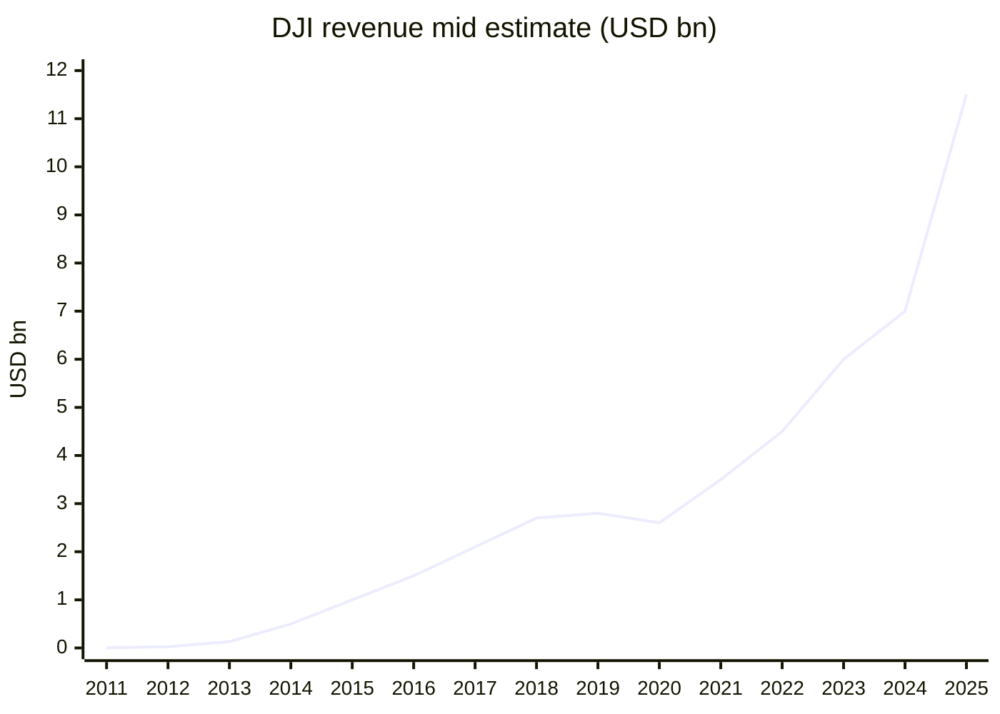
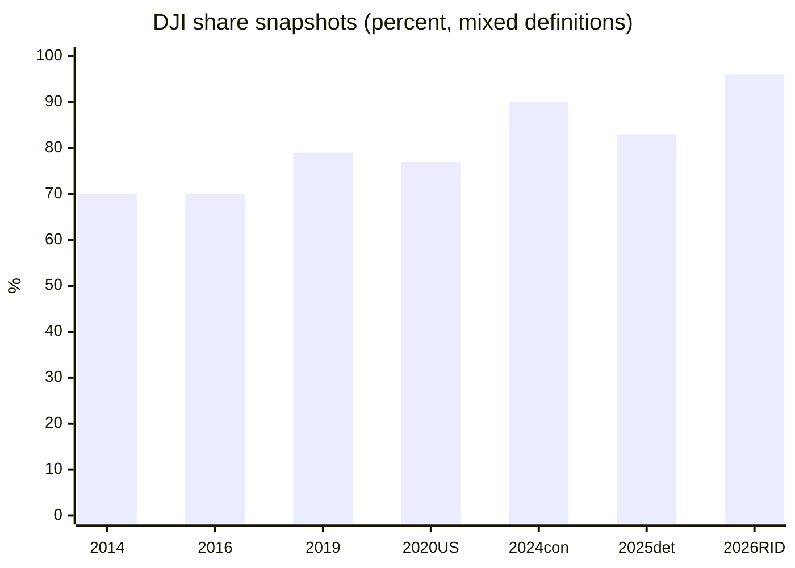
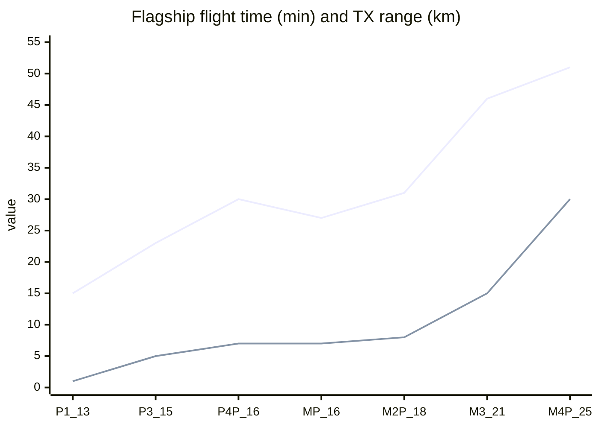

# DJI Dataset (2006–2026)

> 단일 Markdown 데이터셋. 서술형 보고서가 아니라 **표·시계열·스펙 매트릭스** 중심.
> 스프레드시트/노트북에 그대로 붙여넣을 수 있게 열 이름을 고정했다.
> DJI는 비상장사이므로 매출·출하량은 **공시가 아닌 언론·위키·시장조사업체 추정치**다. 출처가 갈리면 `value_low`/`value_high`와 `note`를 함께 둔다.
>
> 기준일: 2026-09-29  
> 통화: USD는 당시 환율 근사. CNY 원치는 별도 열.

---

## 0. 사용 방법 (dataset schema)

권장 테이블 ID:

| table_id | 내용 |
|---|---|
| T01 | 기업 식별자 |
| T02 | 연표 마일스톤 |
| T03 | 연간 매출 추정 |
| T04 | 출하·누적 대수 |
| T05 | 드론 시장점유율 |
| T06 | 핸드헬드 카메라/짐벌 점유율 |
| T07 | 소비자 드론 라인업 |
| T08 | 핸드헬드·짐벌 라인업 |
| T09 | 엔터프라이즈·농업 라인업 |
| T10 | 플래그십 비행·영상 스펙 진화 |
| T11 | 카메라 센서 진화 |
| T12 | 규제·지정 이벤트 |
| T13 | 향후 계획·확장 영역 |

---

## T01. 기업 식별자

| field | value | source_note |
|---|---|---|
| legal_name_zh | 深圳大疆创新科技有限公司 | wiki |
| trade_name | DJI | Da-Jiang Innovations |
| founded | 2006-01-18 | EN wiki |
| founder | Frank Wang / 汪滔 (Wang Tao) | wiki |
| birth_year_founder | 1980 | Forbes/wiki |
| hq | DJI Sky City, Nanshan, Shenzhen, Guangdong, CN | wiki |
| type | private, partly state-owned (소수 지분) | EN wiki |
| employees_cited | 14000 | 2018 이후 반복 인용. 일부 매체 24000도 존재 |
| valuation_2018_usd_bn | 15 | 2018 펀딩 당시 보도 |
| funding_disclosed_usd_bn | 1.05–1.14 | Series 누적, 2018 $1B 라운드 포함 |
| ipo | none as of 2026-09 | 2018 이후 HK IPO 루머만 |
| key_acquisition | Hasselblad majority 2019-01 (제휴 2015-11) | wiki |
| other_products_2024_2026 | e-bike motor (2024), Romo robot vacuum (2025), auto ADAS unit spun out | wiki / KR press |
| patents_cited | 8600+ (발명특허 ~65%) | 2026 프로파일 보도 |

초기 자금:

| year | item | amount | note |
|---|---|---|---|
| 2006 | 가족/장학금 + 선전 이전 | ~CNY 200,000 임대·시작 | Medium/Forbes 계열 |
| 2006 | Lu Di 투자 | USD 90,000 | Forbes |
| 2010 | HKUST 팀 투자 | CNY 2,000,000 | ZH wiki |
| 2006 초기 판매 | 비행제어기 | CNY 50,000 /대, 원가 ~15,000 | Forbes 인터뷰 |

---

## T02. 연표 마일스톤

| year | month | event | category |
|---|---|---|---|
| 2003 | | 汪滔 HKUST 입학 | origin |
| 2005 | | ABU Robocon 3위, 헬기 비행제어 프로젝트 | origin |
| 2006 | 01 | DJI 설립. 부품(FC/짐벌) B2B | founding |
| 2008 | | XP3.1 헬기 비행제어 출시 | product |
| 2009 | | Everest 피크 비행(부품 사용) | milestone |
| 2010 | | 취미시장·해외 유통 전환. 월매출 CNY 100,000 | business |
| 2013 | 01 | Phantom 1. 완성형 컨슈머 쿼드 | product |
| 2013 | 12 | Phantom 2 | product |
| 2014 | 06 | Ronin 1 핸드헬드 시네마 짐벌 | product |
| 2014 | 11 | Inspire 1 | product |
| 2014 | | 연간 ~40만대, 매출 ~USD 0.5B | sales |
| 2015 | 04 | Phantom 3 Adv/Pro (내장 4K + 라이브) | product |
| 2015 | 10 | Osmo 핸드헬드 | product |
| 2015 | 11 | Hasselblad 전략 제휴 | corp |
| 2015 | | 매출 ~USD 1B, 글로벌 상용 점유 ~70% | sales |
| 2016 | 03 | Phantom 4 (전방 장애물) | product |
| 2016 | 09 | Mavic Pro (접이식) | product |
| 2016 | 11 | Inspire 2, Phantom 4 Pro (1" 센서) | product |
| 2017 | 05 | Spark | product |
| 2017 | | Emmy Tech/Engineering (카메라 드론) | award |
| 2018 | 01 | Mavic Air, Ronin-S | product |
| 2018 | 08 | Mavic 2 Pro (Hasselblad 1") / Zoom | product |
| 2018 | 11 | Osmo Pocket | product |
| 2018 | | ~USD 1B 펀딩, 기업가치 ~USD 15B. IPO 준비 보도 | corp |
| 2019 | 01 | Hasselblad 지배지분 | corp |
| 2019 | 05 | Osmo Action | product |
| 2019 | 10 | Mavic Mini (249 g) | product |
| 2020 | 12 | US BIS Entity List | regulation |
| 2021 | 10 | Mavic 3 | product |
| 2021 | | Ronin 4D 발표 | product |
| 2022 | 10 | US DoD "Chinese military companies" 리스트 | regulation |
| 2022 | | 매출 CNY 30.14B (ZH wiki) | sales |
| 2023 | 04 | Inspire 3 | product |
| 2023 | 07 | Air 3 | product |
| 2023 | 09 | Mini 4 Pro | product |
| 2023 | 10 | Osmo Pocket 3 | product |
| 2024 | 04 | Avata 2; Agras T50/T25 | product |
| 2024 | | Ag 드론 누적 운용 40만대+ | sales |
| 2025 | 05 | Mavic 4 Pro | product |
| 2025 | | Mini 5 Pro, Neo 2, Flip, Romo | product |
| 2025 | Q3 | 액션캠 점유 66% (GoPro 추월 보도) | market |
| 2025 | 12-22 | FCC Covered List → 신규 모델 미인증 | regulation |
| 2025 | FY | 매출 CNY 80B / USD 11.5B (EN wiki) | sales |
| 2026 | 01 | RS 5 | product |
| 2026 | 02 | 美 정부 상대 제소 (9th Cir.) | regulation |
| 2026 | 03 | Avata 360 | product |
| 2026 | 04 | Osmo Pocket 4 (美 공식 미출시) | product |
| 2026 | 04 | Lito 1 / Lito X1 | product |
| 2026 | Q2 | IDC 핸드헬드 스마트캠 점유 73% | market |
| 2026 | | Agras T55/T100, O4 Ground Station, Dock 3 DFR | product |

---

## T03. 연간 매출 추정

단위: USD billion (근사), CNY billion.

| year | rev_usd_bn_low | rev_usd_bn_mid | rev_usd_bn_high | rev_cny_bn | note |
|---|---:|---:|---:|---:|---|
| 2011 | 0.004 | 0.0042 | 0.005 | | DBR: Phantom 이전 ~USD 4.2M |
| 2012 | 0.026 | 0.026 | 0.03 | | academic paper USD 26M |
| 2013 | 0.130 | 0.131 | 0.15 | | SCMP/AP/Statista 계열 USD 130–131M |
| 2014 | 0.50 | 0.50 | 0.55 | | Reuters ~USD 500M; 40만대 |
| 2015 | 0.90 | 1.00 | 1.10 | 5.98 | 36kr 2015=59.8억 CNY; 다수 매체 USD 1B |
| 2016 | 1.40 | 1.50 | 1.60 | 9.78 | 36kr |
| 2017 | 1.80 | 2.10 | 2.50 | | Statista 페이월; 구간 추정 |
| 2018 | 2.50 | 2.70 | 3.00 | | paper: USD 2.7B, NP USD 0.65B |
| 2019 | 2.40 | 2.80 | 3.20 | | 비공시. 성장 둔화 보도 혼재 |
| 2020 | 2.20 | 2.60 | 3.20 | | 팬데믹·Entity List |
| 2021 | 2.80 | 3.50 | 4.50 | | 구간 |
| 2022 | 4.20 | 4.50 | 21.4 | 30.14 | ZH wiki CNY 30.14B. Craft.co USD 21.4B는 이상치로 별도 |
| 2023 | 4.50 | 6.00 | 7.50 | | 구간. 핸드헬드 급성장 시작 |
| 2024 | 3.50 | 7.00 | 8.00 | 50 | 36kr ~CNY 500억 / 순이익률 40% 보도. ElectroIQ USD 3.5B는 하한 |
| 2025 | 11.0 | 11.5 | 12.0 | 80 | EN wiki CN¥80B = USD 11.5B |
| 2026 | 12.0 | 14.0 | 15.5 | 100 target | 왕타오/36kr: 1000억 CNY 목표. FCC로 美 신규모델 ~USD 1.56B 타격 주장 |

순이익 단편:

| year | net_profit_usd_bn | note |
|---|---:|---|
| 2012 | 0.008 | paper |
| 2015 | 0.250 | paper |
| 2018 | 0.650 | paper |
| 2024 | ~2.8 | 36kr 순이익률 40% × 매출 50B CNY 가정 시. 미검증 |

해외 매출 비중: 2018 기준 **약 80%** (북미 > 유럽). 2025 이후 美 신규인증 차단으로 비중 재편 진행.



---

## T04. 출하·누적 대수

공식 연간 출하 시계열은 없다. 단편만 기록.

| year | metric | value | unit | note |
|---|---|---:|---|---|
| 2006–08 | FC 월판매 | ~20 | units/mo | Forbes 초기 |
| 2014 | 드론 판매 | 400000 | units | ZH wiki, 대부분 Phantom |
| 2023 | 글로벌 출하(한 매체) | 2400000 | units | ElectroIQ. 정의(자사만/시장전체) 불명확 |
| 2024 | Pocket 3 연간 | >5000000 | units | 36kr/Leifeng. 내부 초기 가이던스 30–40만 |
| 2025 Q3 | Pocket 3 누적 | >10000000 | units | 동일 |
| 2020 | Ag 드론 운용 | ~210000 | units | 2024 대비 +90% 역산 |
| 2024 EOY | Ag 드론 운용 | >400000 | units | 90+국 |
| 2024 | 컨슈머 촬영드론 세계 생산 | 6780000 | units | QYResearch 시장 전체, ASP USD 455 |
| 2025 | 상용 UAV 세계 생산 | 218000 | units | QYResearch 상용 정의, ASP USD 4516 |
| 2026 Q2 | 핸드헬드 스마트캠 세계 출하 | 5880000 | units | IDC. DJI 428만+ |

미국 FAA (참고: 등록이지 DJI 출하가 아님)

| as_of | total_reg | recreational | commercial | note |
|---|---:|---:|---:|---|
| 2026 early | 855860 | 536183 (63%) | 316075 (37%) | 다수 2026 통계 기사 |
| 2025-11 | | rec flyer 371334; comm 453635 | | ASSURE/Unmanned Airspace 수치와 집계 기준이 다름 |

---

## T05. 드론 시장점유율

정의가 제각각이다. 같은 해에도 **매출 vs 대수 vs 탐지 vs Remote ID**가 다르다.

| year | geo | segment | metric | dji_share_pct | source |
|---|---|---|---|---:|---|
| 2014 | global | commercial | units | 70 | JPO/Reuters 계열 |
| 2015 | global | commercial | units/rev | 70 | Reuters |
| 2016 | global | consumer | units | >70 | 36kr |
| 2016 | mid-high >CNY1500 | consumer | units+profit | >90 | 36kr |
| 2019 | global | commercial | units | 78.8 | Drone Industry Insights |
| 2020 | US | consumer | rev/units | 77 | EN wiki Mar 2020. 2위 ≤4% |
| 2020 | US | public safety | units in use | ~90 | EN wiki |
| 2021 | US | consumer | | ~80 | Reuters |
| 2023 | global | drone industry | | 79 | Coolest Gadget/ElectroIQ |
| 2024-06 | global | consumer | | >90 | EN wiki |
| 2024 | US | consumer | | 80 | ElectroIQ |
| 2024 | global | civilian | | 74 → 70 | BusinessWire via ElectroIQ |
| 2025 | global | civilian+commercial | | 70–83 | ZH wiki |
| 2025 | global | detections | count | 83.48 | Dedrone. Autel 1.40, DIY 9.82 |
| 2025 | US | consumer | | ~80 | Loyalty/The Drone Girl |
| 2025 | US | first responder agencies | agencies | >80 of 1800+ | China Economy/DJI 주장 |
| 2026-03 | US NAS | Remote ID detections | ops | >96 | FAA ASSURE. Skydio ~1% |
| 2026 | US | consumer | | ~80 | Quantumrun 등 |
| 2026 | US | commercial | | ~70 | Commerce Dept 보도 |
| 2026 | US | pre-FCC overall | | 96 | FAA study 인용 |

2025 Dedrone 탐지 구성:

| brand | share_pct |
|---|---:|
| DJI | 83.48 |
| DIY / FPV builds | 9.82 |
| Autel | 1.40 |
| other | 5.30 |

ASSURE 2025 미국 탐지 모델 상위 (플랫폼 비중):

| model | share_pct | takeoff_mass_lb |
|---|---:|---:|
| Mini 4 Pro | 19 | <0.55 |
| Air 3 | 13 | |
| Mavic 3 Pro | 8 | ~2.1 |
| Air 2S | 7 | |
| Air 3S | 7 | |

시장 규모 참고 (DJI가 아님, 분모):

| market | year | value | cagr | source |
|---|---|---|---|---|
| consumer drones | 2024 | USD 5.18B | 18.2% to 2031 | QY/Bosson |
| consumer drones | 2025 | USD 5.18B | | 동일 계열 |
| consumer camera drones | 2025 | USD 23.5B? / CNY 235B 혼재 | 12.3% | QY 중·영 표기 불일치. 사용 시 원문 확인 |
| commercial UAV | 2025 | CNY 6.704B | 8.6% | QY |
| all drones | 2023 | USD 6.41B | 14.7% to 2030 USD 17.5B | QY. top1 ~60% |
| all drones | 2025 | USD 36.8–40.5B | | ElectroIQ (정의 넓음) |
| all drones | 2026 | USD 63.6–96.4B | | 매체별 편차 큼 |



---

## T06. 핸드헬드 카메라 / 짐벌 / 액션캠 점유율

DJI가 드론 다음으로 가져간 축. Osmo Action + Pocket + Mobile + 360 + Ronin.

| year | geo | category | dji_share_pct | peer | source |
|---|---|---|---:|---|---|
| 2022–23 | global | action cam revenue | <25 est. | GoPro >75 | Chanson/Galaxy |
| 2024 | global | action cam revenue | 44 | | Galaxy 증권 |
| 2025 H1 | JP | action cam | 35.3 | GoPro 추월 | BCN |
| 2025 FY | JP | action cam | 40.1 | Insta360 37.9, GoPro 18.9 | BCN / PetaPixel |
| 2025 FY | JP | video cameras | 64.7 | Panasonic 18.9, Sony 11.1 | BCN |
| 2025 Q1–Q3 | global | action cam revenue | 66 | GoPro 18, Insta360 13 | Chanson |
| 2025 Q3 | global | 360 cam | 43 | 출시 3개월 Osmo 360 | ZH wiki / CBI |
| 2025 FY | global | handheld shipments | 62.4 | Insta360 20.4, GoPro 10.8 | BigGo |
| 2026 Q1 | global | handheld shipments | 65 | Insta360 22, GoPro <6 | BigGo. DJI 270만대 |
| 2026 Apr | JP | video cameras | 72.5 | Pocket 4 9일 만에 월 21.5% | BCN / PetaPixel |
| 2026 Q2 | global | handheld smart cam | 73 | Insta360 20. GoPro action -49% YoY | IDC. DJI 428만대 / 시장 588만+ |

IDC Q2 2026 카테고리 출하:

| category | units | yoy_pct |
|---|---:|---:|
| all handheld smart cameras | 5880000+ | 57 |
| DJI | 4280000+ | 87 |
| Insta360 | 1150000+ | 40 |
| gimbal cameras | ~2800000 | 87 |
| action cameras | 2550000+ | 47 |
| 360 cameras | 530000+ | 4 |

Ronin: 2025 Ronin 2 Academy Sci-Tech Award.

---

## T07. 소비자 드론 라인업

상태: `flagship` / `mid` / `entry` / `fpv` / `toy` / `eol`

### T07a. Phantom (精灵) — 2013–2017 주력, 이후 단종

| model | announce | weight_g | flight_min | cam | video_max | tx_km | note |
|---|---|---:|---:|---|---|---:|---|
| Phantom 1 | 2013-01 | 670–1200 | 10–15 | GoPro mount | n/a onboard | ~1 | RTF + GPS. USD 629 |
| Phantom 2 | 2013-12 | ~1000 | 25 | mount | | | 배터리↑ |
| Phantom 2 Vision / + | 2014 | | 25 | FC200 14MP | 1080p | Wi-Fi | 내장캠 시작 |
| Phantom 3 Std/Adv/Pro/4K | 2015–16 | ~1216 | 23 | 1/2.3" 12MP | 2.7K / 4K30 | Lightbridge | 대중화 변곡 |
| Phantom 4 | 2016-03 | 1380 | 28 | 1/2.3" 12MP | 4K30 | 5 | 전방 OA |
| Phantom 4 Pro / V2 | 2016-11 / 2018 | 1388 | 30 | 1" 20MP mech shutter | 4K60 | 7 | 5방향 센싱 |

### T07b. Inspire — 시네마 공중

| model | announce | note |
|---|---|---|
| Inspire 1 / Pro / RAW | 2014-11 | 랜딩기어 상승, Zenmuse X3/X5 |
| Inspire 2 | 2016-11 | 94 km/h, ProRes/CinemaDNG |
| Inspire 3 | 2023-04 | 풀프레임 시네마 |

### T07c. Mavic / Air / Mini / Neo / Flip / Lito

| family | model | announce | weight_g | flight_min | sensor | video_max | tx_km_fcc | oa |
|---|---|---|---:|---:|---|---|---:|---|
| Mavic | Pro | 2016-09 | 743 | 27 | 1/2.3" 12MP | 4K30 | 7 | 전/하 |
| Mavic | Pro Platinum | 2017-08 | 734 | 30 | same | 4K30 | 7 | |
| Mavic | 2 Pro | 2018-08 | 907 | 31 | Hasselblad 1" 20MP | 4K30 | 8 | omni |
| Mavic | 2 Zoom | 2018-08 | 905 | 31 | 1/2.3" 24-48mm | 4K30 | 8 | omni |
| Mavic | 3 / Cine / Classic | 2021–22 | 895 | 46 | 4/3 20MP + tele | 5.1K50 | 15 | omni |
| Mavic | 3 Pro | 2023-04 | 958 | 43 | 4/3 20 + 1/1.3 48 + 1/2 12 | 5.1K50 | 15 | omni |
| Mavic | 4 Pro | 2025-05 | 1063 | 51 | 4/3 100 + 1/1.3 48 + 1/1.5 50 | 6K60 | 30 | omni |
| Spark | Spark | 2017-05 | 300 | 16 | 1/2.3" 12MP | 1080p | 2 | 전 |
| Air | Mavic Air | 2018-01 | 430 | 21 | 1/2.3" 12MP | 4K30 | 4 | 3방향 |
| Air | Air 2 | 2020-04 | 570 | 34 | 1/2" 48MP | 4K60 | 10 | 3방향 |
| Air | Air 2S | 2021-04 | 595 | 31 | 1" 20MP | 5.4K30 | 12 | 4방향 |
| Air | Air 3 | 2023-07 | 720 | 46 | dual 1/1.3" 48 | 4K60 | 20 | omni |
| Air | Air 3S | 2024 | ~724 | 45 | 1" + 1/1.3" | 4K120 | 20 | omni+LiDAR |
| Mini | Mavic Mini | 2019-10 | 249 | 30 | 1/2.3" 12MP | 2.7K | 4 | 하 |
| Mini | Mini 2 / SE / 2 SE / 4K | 2020–24 | 242–249 | 31 | 12MP class | 2.7K–4K | 6–10 | 하 |
| Mini | Mini 3 / 3 Pro | 2022 | 249 / 249 | 38 / 34 | 1/1.3" 48 | 4K60 / 4K60 | 10 / 12 | 하 / omni-ish |
| Mini | Mini 4 Pro | 2023-09 | 249 | 34 | 1/1.3" 48 | 4K100 | 20 | omni |
| Mini | Mini 5 Pro | 2025 | 249.9 | 36–52 (Plus batt) | 1" 50MP | 4K60 HDR | | omni, 225° gimbal |
| FPV | DJI FPV | 2021-03 | 795 | 20 | 1/2.3" 4K60 | 4K60 | 10 | 전 |
| FPV | Avata | 2022-08 | 410 | 18 | 1/1.7" 4K60 | 4K60 | 10 | |
| FPV | Avata 2 | 2024-04 | 377 | 23 | 1/1.3" 4K60 | 4K60 | 13 | |
| FPV | Avata 360 | 2026-03 | | | dual 1/1.1" | 8K60 360 | | FPV+360 |
| palm | Neo / Neo 2 | 2024–25 | 135 | ~18 | 1/2" 4K | 4K | short | palm TO |
| palm | Flip | 2025 | | | | | | |
| new | Lito 1 / Lito X1 | 2026-04 | | | | | | 신패밀리 |

Tello (2018, Ryze Tech): 교육/토이. RoboMaster S1/EP: 교육 로봇.

---

## T08. 핸드헬드·짐벌·마이크 라인업

### Osmo Pocket

| model | year | sensor | video | note |
|---|---|---|---|---|
| Osmo Pocket | 2018 | 1/2.3" | 4K60 | 3축 포켓 짐벌캠 카테고리 개척 |
| Pocket 2 | 2020 | 1/1.7" 64MP | 4K60 | |
| Pocket 3 | 2023 | 1" 9.4mm | 4K120 | 2024 500만+, 누적 1000만+ |
| Pocket 4 | 2026-04 | | | 美 공식 채널 미출시 |
| Pocket 4P | 2026 | dual | | Cannes 공개, 美 차단 |

### Osmo Action / 360 / Nano / Mobile

| model | year | note |
|---|---|---|
| Osmo (handheld cam) | 2015 | 짐벌+카메라 |
| Osmo Mobile 1→8 / 8P | 2016–2026 | 스마트폰 짐벌. ActiveTrack 세대 증가 |
| Osmo Action | 2019 | GoPro 대항 |
| Action 3 / 4 / 5 Pro / 6 | 2022–25 | HorizonSteady, 긴 배터리, 수심 |
| Osmo 360 | 2025-07 | 3개월 내 글로벌 360 43% |
| Osmo 360 II | 2026-08 CN / 09 global | dual 1/1.1", 14.5-stop |
| Osmo Nano | 2025 | 웨어러블 |

### Ronin

| model | year | payload_kg | form |
|---|---|---:|---|
| Ronin 1 | 2014-06 | 7.25 | 투핸들 |
| Ronin-M | 2015 | 3.6 | 경량 |
| Ronin-MX | 2016 | 4.5 | 공중+지상 |
| Ronin 2 | 2017 | 13.6 | 헤일로. 2025 Academy |
| Ronin-S / SC | 2018–19 | 3.6 / 2.0 | 싱글핸들 미러리스 |
| RS 2 / RSC 2 | 2020 | | |
| RS 3 / 3 Pro / 3 Mini | 2022–23 | | |
| Ronin 4D 6K / 8K | 2021 / 2023 | cinema cam | LiDAR 포커스 |
| RS 5 | 2026-01 | | AI 트래킹 |

마이크: Mic / Mic Mini / Mini 2 / Mic 3 (2024–26).

---

## T09. 엔터프라이즈·농업·물류

| family | models (선택) | years | role |
|---|---|---|---|
| Spreading Wings | S800/S900/S1000 | 2013–15 | 프로 멀티로터 프레임 |
| Matrice | 100, 200/210, 300 RTK, 350 RTK, 30/30T, 4E/4T, 400 | 2015–2025 | 점검·측량·공공안전. M400: 59 min, payload 6 kg, 7 페이로드 |
| Dock | Dock / Dock 2 / Dock 3 | ~2022–2025 | drone-in-a-box. DFR <100 s. IP56, -30~50°C |
| Mavic Enterprise | M2E/Dual, M3E/T/M, Matrice 4 compact | 2018–2026 | 열화상·멀티스펙·RTK |
| Agras | MG-1 → T10/T20/T30/T40/T50/T25 → T55/T100 | 2015–2026 | 방제·파종. 2024 운용 40만+ |
| FlyCart | 30, 100 | 2023–26 | 화물. 2025 Everest 고고도 테스트 |
| Zenmuse payloads | X3–X9, XT/XT2/XT S, H20/H20N/H30, P1, L1/L2, H30T | 2014– | 카메라·열·라이다·줌 |
| Ground | O4 Ground Station 2026 | | Dock 통신 중계 |

농업 임팩트 (회사 주장, 2026 프로파일):

| metric | value |
|---|---|
| China farmland covered | 32.9 million acres |
| water saved | 410 million metric tons |
| CO2 reduced | 51 million metric tons |

---

## T10. 플래그십 비행·영상 스펙 진화

비교 기준: 각 세대 **당시 컨슈머 플래그십** (Phantom → Mavic Pro → Mavic 2 Pro → Mavic 3 → Mavic 4 Pro). Mini는 규제 회피(249 g) 축.

| gen | model | year | mass_g | flight_min | vmax_kph | tx_km | photo_mp | video | sensor |
|---|---|---:|---:|---:|---:|---:|---:|---|---|
| 0 | XP3.1 / DIY FC | 2008 | n/a | n/a | n/a | n/a | n/a | n/a | none |
| 1 | Phantom 1 | 2013 | 670 | 15 | 36 | 1 | mount | n/a | GoPro |
| 2 | Phantom 3 Pro | 2015 | 1280 | 23 | 57 | 2–5 | 12 | 4K30 | 1/2.3" |
| 3 | Phantom 4 Pro | 2016 | 1388 | 30 | 72 | 7 | 20 | 4K60 | 1" |
| 4 | Mavic Pro | 2016 | 743 | 27 | 65 | 7 | 12 | 4K30 | 1/2.3" |
| 5 | Mavic 2 Pro | 2018 | 907 | 31 | 72 | 8 | 20 | 4K30 | 1" Hasselblad |
| 6 | Mavic 3 | 2021 | 895 | 46 | 75 | 15 | 20 | 5.1K50 | 4/3 Hasselblad |
| 7 | Mavic 3 Pro | 2023 | 958 | 43 | 75 | 15 | 20+48+12 | 5.1K50 | triple |
| 8 | Mavic 4 Pro | 2025 | 1063 | 51 | 65 | 30 | 100+48+50 | 6K60 | 4/3 100MP triple |

배율 (Phantom 1 → Mavic 4 Pro):

| metric | p1 | m4p | factor |
|---|---:|---:|---:|
| flight_min | 15 | 51 | 3.4× |
| tx_km | 1 | 30 | 30× |
| photo_mp (main) | 12 (GoPro) | 100 | 8.3× |
| video | 1080 ext | 6K60 | |
| mass_g | 670 | 1063 | 1.6× |
| OA directions | 0 | omni | |

Mini 축 (규제 최적화):

| model | year | mass_g | flight_min | video | sensor |
|---|---:|---:|---:|---|---|
| Mavic Mini | 2019 | 249 | 30 | 2.7K | 1/2.3" 12MP |
| Mini 2 | 2020 | 249 | 31 | 4K30 | 1/2.3" 12MP |
| Mini 3 Pro | 2022 | 249 | 34 | 4K60 | 1/1.3" 48MP |
| Mini 4 Pro | 2023 | 249 | 34 | 4K100 | 1/1.3" 48MP |
| Mini 5 Pro | 2025 | 249.9 | 36–52 | 4K60 HDR | 1" 50MP |



전송 세대: Wi-Fi → Lightbridge → OcuSync 1/2/3/4 → O4.

장애물: 없음 → 전방(P4) → 5방향(P4P) → 전방위(M2) → 전방위+LiDAR(Air 3S 등).

---

## T11. 카메라 센서 진화 (항공기)

| year | model | sensor | mp | notes |
|---|---|---|---:|---|
| 2013 | Phantom 1 | external GoPro | 12 | 짐벌 별매 |
| 2014 | P2 Vision | 1/2.3" | 14 | 내장 + Wi-Fi FPV |
| 2015 | P3 / Inspire X3 | 1/2.3" | 12 | 4K |
| 2015 | Zenmuse X5 | M4/3 | 16 | 렌즈 교환 |
| 2016 | P4 Pro | 1" | 20 | 기계셔터 |
| 2018 | Mavic 2 Pro | 1" Hasselblad L1D-20c | 20 | 브랜드 광학 |
| 2021 | Mavic 3 | 4/3 Hasselblad | 20 | + 162mm tele 12MP |
| 2023 | Mavic 3 Pro | 4/3 + 1/1.3 + 1/2 | 20/48/12 | 트리플 |
| 2025 | Mavic 4 Pro | 4/3 + 1/1.3 + 1/1.5 | 100/48/50 | 28–168mm equiv, 6K60 |
| 2025 | Mini 5 Pro | 1" | 50 | 249.9 g 안에 1" |

BOM/마진 단편 (Arena Physica 분해, Mini 라인 2019–23):

| item | value |
|---|---|
| hardware gross margin Mini | 72% → 79% |
| China-sourced BOM share | +28 pp (in-housing 22 pp) |
| Mini 4 Pro custom electronics share of BOM | 26% (Mavic Mini 1%) |
| iPhone 15 Pro Max GM (비교) | 53% |

커스텀 실리콘: ~2015(매출 USD 1B 시점) 착수 추정.

---

## T12. 규제·지정 이벤트 (시장 분모에 영향)

| date | actor | action | effect |
|---|---|---|---|
| 2020-12 | US BIS | Entity List | 미 부품 조달 제한 |
| 2021-01 | US EO | 연방 기단 중국제 드론 제거 | 공공조달 |
| 2021-12 | US | 미국인 투자 금지 | 자본 |
| 2022-10 | US DoD | Chinese military companies | 지정. 2025-09 DJI 패소 |
| 2024-10 | CBP | UFLPA 일부 수입 정지 | 통관 |
| 2025-12-22 | FCC | Covered List | **신규 모델 인증 불가**. 기존 승인분은 판매·운용 가능 |
| 2026-02-20 | DJI | 9th Circuit 제소 | 진행 |
| 2026 | DJI filing | 2026 출시 25종 차단, 美 매출 USD 1.56B 손실 주장 | 회사 주장 |
| 2026-07 | FCC | capability-based 확대안 제안 (열·라이다·Dock·방제·25kg+) | 미확정 |
| 2025 | DJI | RU/UA 상업 활동 중단 발표 | 전장 우회 유통은 보도 지속 |

한국·EU·기타: 250 g / C0–C3 / Remote ID가 Mini 설계를 규정.

---

## T13. 향후 계획·확장 축 (2025–2027)

공시 로드맵은 없다. 출시·인터뷰·엔터프라이즈 백서로 재구성.

| pillar | 2025–26 evidence | direction |
|---|---|---|
| consumer imaging | Pocket 4/4P, Action 6, 360 II, Mobile 8P, Mini 5 Pro, Mavic 4 Pro | 드론 ASP 하락을 핸드헬드로 상쇄. 이미 출하 점유 1위 |
| FPV / 360 hybrid | Avata 360 8K60 | 액션+드론 교차 |
| enterprise autonomy | Dock 3 + FlightHub 2 Auto-Dispatch, O4 GS, onboard AI challenge | DFR, 무인 순찰, 점검 |
| agriculture | T50/T25 → T55/T100 | 대형 탱크·다국 운용 |
| logistics | FlyCart 30/100, Everest 2025 test | 고고도·화물 |
| robotics transfer | Romo 청소기 2025, 차량 ADAS 분사 | 비전·회피 스택 지상 이전 |
| energy | Power 1000 Mini 2026 | 배터리 주변기기 |
| software | FlightHub 2 워크플로, Care, 부품 | 하드웨어 이후 반복매출 |
| geo strategy | 美 신규모델 봉쇄 → 중국·EU·중동·LATAM·아태 비중↑ | 1000억 CNY 목표와 충돌 가능 |

왕타오 2025 인터뷰 요지: 최근 3년 신규 프로젝트 남발 대신 **영상 장비(드론 제외)를 최우선**, 농업·물류·로봇·차량은 기존 스택 재배치. 2026 매출 CNY 100B 공언.

경쟁 구도 (컨슈머): Autel, Skydio(미 공공·국방), Parrot, Insta360(핸드헬드), GoPro(하락).
경쟁 구도 (농업): XAG.
경쟁 구도 (배달): Zipline, Wing — DJI는 하드웨어 공급 쪽에 가깝다.

---

## 부록 A. 제품군 코드북

| code | meaning |
|---|---|
| P | Phantom |
| I | Inspire |
| M | Mavic (구형 접이식 플래그십) |
| A | Air |
| N | Mini |
| F | FPV / Avata |
| E | Enterprise Matrice / Dock |
| G | Agras |
| C | Osmo camera (Pocket/Action/360) |
| S | Osmo Mobile (phone gimbal) |
| R | Ronin |
| Q | payload Zenmuse |
| V | vacuum / other robot |
| L | Lito (2026) |

---

## 부록 B. 데이터 품질 플래그

| field | quality | reason |
|---|---|---|
| founding / lineup dates | high | 공식·위키 교차 |
| specs | high | 공식 스펙. 비행시간은 무풍 랩 수치, 실사용 15–20% 하회 |
| market share | medium | 정의 불일치. 탐지≠판매≠매출 |
| annual revenue 2019–2024 | low–medium | 비상장. 출처 간 2–3배 차이 |
| 2025 revenue CNY 80B | medium | EN wiki 1차 인용, 원전 재무제표 없음 |
| Pocket 3 500만/1000만 | medium | 중국 테크 매체, 회사 미확인 |
| Craft.co 2022 USD 21.4B | reject as outlier | CNY 30.14B와 충돌 |

복제용 CSV 헤더 예시:

```
year,rev_usd_bn_mid,rev_cny_bn,consumer_share_pct,us_share_pct,handheld_share_pct,ag_units_cum
```

---

## 부록 C. 핵심 출처 (교차검증용)

- EN/ZH Wikipedia: DJI, Frank Wang, DJI Ronin (2026-09 스냅샷)
- AP / Forbes / SCMP 2013–15 초기 매출
- 36kr / Leifeng 2015–16 CNY 매출, 2024–25 가이던스, Pocket 3 출하
- Dedrone 2025 detections
- FAA ASSURE 2025 Remote ID (2026-03 보도)
- IDC Handheld Smart Camera Q2 2026
- BCN+R Japan 2025–26 video/action
- Chanson & Co. / 중국은하 액션캠 2025
- QYResearch 컨슈머·상용 UAV 시장 규모
- Arena Physica Mini BOM 2019–23
- DJI 공식 비교표 / Enterprise Dock 백서 2026-06
