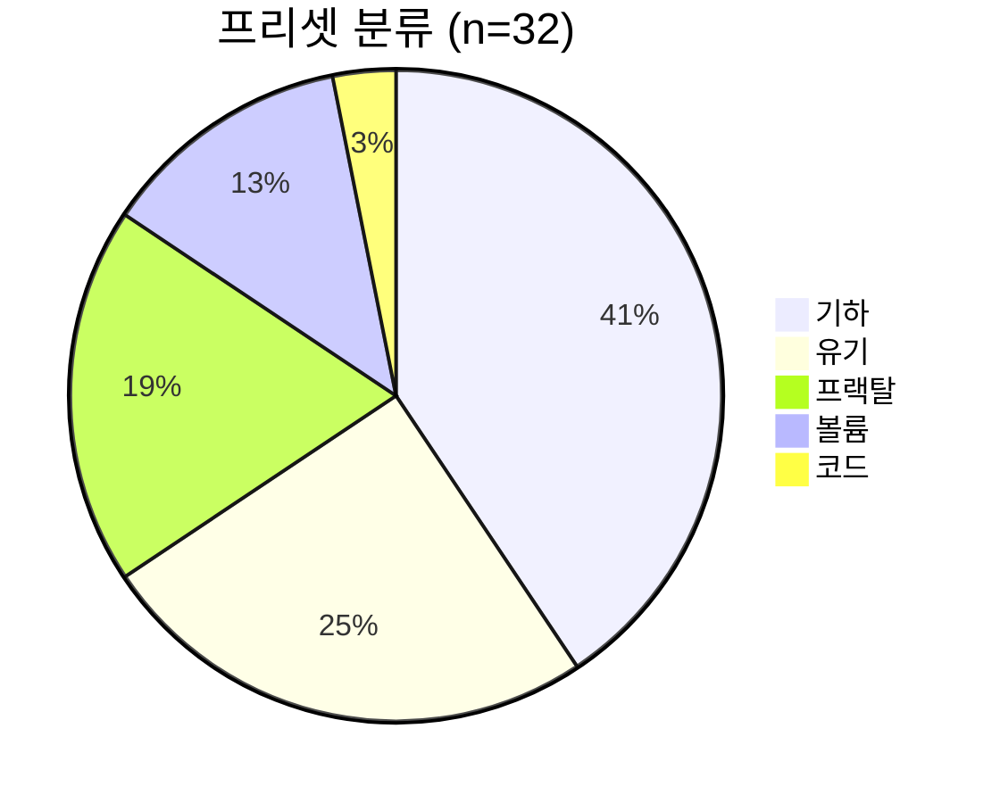
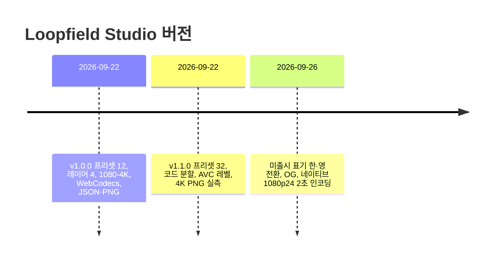

# Loopfield Studio

브라우저에서 돌아가는 **WebGL 2 + GLSL** 루프 영상 스튜디오.  
프리셋·레이어·슬라이더로 기하·프랙탈·유기·볼륨 패턴을 합성하고, 기기 GPU에서 PNG 또는 무음 H.264 MP4를 내보낸다.  
계정·업로드·렌더 서버·외부 셰이더 라이브러리는 없다. 처리는 전부 로컬이다.

공개 소개 문구(영문 원문): Creating a Graphic Loop Video.  
한 줄 설명(영문 원문): Create high-resolution motion loops with GLSL and layered patterns.  
한국어 소개: 간단한 GLSL과 레이어 조합으로 만드는 고해상도 기하학 루프 영상.

제작: JTech Co. 라이선스 MIT.  
실행 주소: https://jtech-co.github.io/Loopfield-Studio/


---

## 0. 식별자

| 항목 | 값 |
|---|---|
| 이름 | Loopfield Studio |
| 패키지명 | loopfield-studio |
| HTML 제목 | Loopfield Studio \| 기하학 루프 영상 생성기 |
| OG 제목 | Loopfield Studio - Create your next infinite loop |
| OG 사이트명 | Loopfield Studio |
| OG 로케일 | ko_KR (대체 en_US) |
| 테마색 | #111318 |
| 정규 URL | https://jtech-co.github.io/Loopfield-Studio/ |
| 저장키·프로젝트 | `loopfield.project.v1` |
| 저장키·언어 | `loopfield.language.v1` |
| 프로젝트 형식 | `loopfield-project` |
| 프로젝트 스키마 | `1` |
| 앱 버전 상수 | `1.1.0` |
| 최초 공개 | 1.0.0 / 2026-09-22 |
| 마지막 문서화 갱신 | 2026-09-26 (한·영 전환, 브랜딩, OG) |

---

## 1. 기능 목록

값은 있음=1, 없음=0. 코드 식별자는 원문 유지.

| 번호 | 기능 | 값 |
|---|---|---|
| F01 | 셰이더 프리셋 | 32 |
| F02 | 최대 레이어 | 4 |
| F03 | 블렌드 모드 | 5 (`normal`, `screen`, `add`, `multiply`, `difference`) |
| F04 | 팔레트 | 6종 × 색 3개 |
| F05 | 커스텀 GLSL 편집 | 1 |
| F06 | 슬라이더 문법 | `@slider 이름 최소 최대 간격 기본값 \| 표시명` |
| F07 | 레이어당 슬라이더 상한 | 16 |
| F08 | 레이어당 소스 글자 상한 | 48000 |
| F09 | JSON 가져오기 상한 | 1,048,576바이트 |
| F10 | 실시간 미리보기 | 1 |
| F11 | 블룸 | 1 (SDR, HDR 아님) |
| F12 | 노출 | 1 |
| F13 | 대비 | 1 |
| F14 | 비네트 | 1 |
| F15 | 색수차 | 1 |
| F16 | 루프 경계 검사 | 1 (표본 4장) |
| F17 | PNG 내보내기 | 1 |
| F18 | H.264 MP4 내보내기 | 1 (무음) |
| F19 | 프로젝트 JSON 입출력 | 1 (적용본 + 초안) |
| F20 | localStorage 자동저장 | 1 |
| F21 | 한·영 즉시 전환 | 1 (브라우저에 기억) |
| F22 | 데스크톱·태블릿·모바일 반응형 | 1 |
| F23 | 코드 모드 분할 | 30–70%, 기본 56% |
| F24 | 미리보기 화질과 내보내기 해상도 분리 | 1 |
| F25 | 한 프레임 인코더 시험 | 1 |
| F26 | 내보내기 취소 | 1 |
| F27 | 디스크 직접 저장 | File System Access (선택) |
| F28 | 동작 축소 | 미리보기 일시정지, 내보내기 마크 정지 |
| F29 | CSP | self + blob 미디어·이미지 + style unsafe-inline |
| F30 | 추적 스크립트 | 0 |
| F31 | 프로젝트 스크립트 실행 | 0 |
| F32 | iChannel 텍스처 | 0 |
| F33 | 멀티패스 버퍼 | 0 |
| F34 | 오디오 트랙 | 0 |
| F35 | 딥줌 프랙탈 | 0 (float, 확대 ≤ 64) |
| F36 | 계정·백엔드 | 0 |

### 화면 모드

| 모드 | 배치 | 비고 |
|---|---|---|
| 만들기 | 라이브러리 \| 미리보기 \| 설정 | 기본 |
| 코드 | 미리보기 \| 구분선 \| 편집기 | 라이브러리·설정은 서랍 |
| 너비 ≥ 768 | 좌우 배치 | 1024, 768에서 검증 |
| 너비 ≤ 760 / 390 | 세로 적재 | 가로 넘침 없음 |

단축키: Space 재생, Ctrl/Cmd+S 저장, Ctrl/Cmd+Enter 컴파일, Esc 닫기·취소, Tab 편집기 2칸.

---

## 2. 출력 공간

### 2.1 해상도 × 화면비

DCI 2K는 가로만. 나머지 3종은 가로·세로·정사각.

| 해상도 | 가로 너비 | 가로 높이 | 픽셀 | 메가픽셀 | 세로 | 정사각 | 문서상 H.264 레벨(30fps) |
|---|---:|---:|---:|---:|---|---|---|
| 1080p | 1920 | 1080 | 2,073,600 | 2.074 | 1080×1920 | 1080×1080 | — |
| dci2k | 2048 | 1080 | 2,211,840 | 2.212 | 없음 | 없음 | 4.2 이상 |
| qhd | 2560 | 1440 | 3,686,400 | 3.686 | 1440×2560 | 1440×1440 | 5.0 이상 |
| uhd | 3840 | 2160 | 8,294,400 | 8.294 | 2160×3840 | 2160×2160 | 5.1 이상, 60fps는 5.2 이상 |

출력 조합: DCI 1종 + 나머지 3×3 = **10쌍**.

### 2.2 시간축

| 항목 | 값 집합 | 기본 |
|---|---|---|
| 초당 프레임 | 24, 30, 60 | 30 |
| 길이(초) | 2–60 정수 | 8 |
| 화질 | standard, high, master | high |
| 인코더 선호 | auto, hardware, software | auto |
| 프레임 수 N | 길이 × 초당프레임 | 기본 240 |

프레임 수 격자:

| 길이(초) \ 초당프레임 | 24 | 30 | 60 |
|---:|---:|---:|---:|
| 2 | 48 | 60 | 120 |
| 8 | 192 | 240 | 480 |
| 60 | 1440 | 1800 | 3600 |

최대 프레임 **3600** (60초 × 60fps).  
타임스탬프: `round(i × 1e6 / fps)` 마이크로초. 마지막 위상 `(N−1)/N`. 위상 1 중복 프레임 없음.

### 2.3 비트레이트 식 (앱 내부)

```
가중 = {standard:12, high:20, master:32}[화질]
bitrate_bps = round(min(180, 가중 * (너비*높이/2073600)^0.85 * (fps/30)^0.65) * 1e6)
```

상한 180 Mbps. 가로·high 기준 스케일:

| 설정 | 식 | 메모 |
|---|---|---|
| 1080p30 high | 가중 20 × 1.00 × 1.00 | 20 Mbps 스케일 |
| UHD30 high | 가중 20 × (8.294/2.074)^0.85 | 해상도 가중 |
| UHD60 master | 가중 32 × 해상도 × 2^0.65 | 180 Mbps 상한에 걸릴 수 있음 |

메모리 MP4 페이로드 상한 **256 MiB**. GPU·코덱·Blob 메모리는 별도.

### 2.4 미리보기 화질 (편집 전용)

540p, 720p, 1080p, 1440p, 2160p. 내보내기 해상도와 독립.

---

## 3. 레이어·이펙트 범위

| 항목 | 최소 | 최대 | 기본 | 형 |
|---|---:|---:|---|---|
| 레이어 수 | 1 | 4 | 1 | 정수 |
| 불투명도 | 0 | 1 | 1 | 실수 |
| 확대 | 0.25 | 64 | 1 | 실수 |
| 회전(도) | -180 | 180 | 0 | 실수 |
| 오프셋 x,y | -100 | 100 | 0 | 실수 |
| 주기 수 | 1 | 8 | 1 | 정수 |
| 위상 | 0 | 1 | 0 | 실수 |
| 시드 | 0 | 999 | 3 | 실수 |
| 색조 | 0 | 1 | 0 | 실수 |
| 블룸 | 0 | 1.5 | 0.35 | 실수 |
| 노출 | 0.3 | 2 | 1.15 | 실수 |
| 대비 | 0.5 | 1.8 | 1.08 | 실수 |
| 비네트 | 0 | 1 | 0.25 | 실수 |
| 색수차 | 0 | 1 | 0 | 실수 |
| 레이어 이름 | — | 60자 | — | 문자열 |
| 프로젝트 이름 | — | 80자 | — | 문자열 |
| 파일 안전 이름 | — | 72자 | Loopfield | 문자열 |

배경 기본 `#080b12`.  
새 레이어 기본 블렌드 Screen.  
신규 세션 기본 프리셋 **Prism Bloom** (`prism`).

---

## 4. 팔레트 6종

| 번호 | 이름 | A | B | C |
|---:|---|---|---|---|
| 0 | 오로라 | `#65fbd5` | `#ac76ff` | `#ffb86c` |
| 1 | 일몰 | `#ff543e` | `#ffc879` | `#a63cff` |
| 2 | 빙하 | `#b7fbff` | `#409eff` | `#6862ef` |
| 3 | 아날로그 | `#fce5b4` | `#e6a065` | `#647b73` |
| 4 | 캔디 | `#ff64bc` | `#6fe8ff` | `#fff1a3` |
| 5 | 모노 | `#f7f4ed` | `#8a929d` | `#dbe6ed` |

`palette(float)`가 세 색을 vec3로 보간. 유니폼 `uColorA/B/C`, `uHue`.

---

## 5. 프리셋 32종

분류 분포: 기하 13, 유기 8, 프랙탈 6, 볼륨 4, 코드 1.



| 식별자 | 영문 이름 | 한글 이름 | 분류 | 슬라이더 | 코드 글자 | 설명 |
|---|---|---|---|---:|---:|---|
| prism | Prism Bloom | 프리즘 블룸 | 기하 | 3 | 473 | 겹겹의 빛으로 만드는 회전 대칭 패턴 |
| mandelbrot | Mandelbrot | 망델브로 집합 | 프랙탈 | 3 | 659 | z²+c 탈출 시간과 카메라 호흡 루프 |
| julia | Julia orbit | 줄리아 궤도 | 프랙탈 | 4 | 654 | 복소 상수 c가 닫힌 궤도를 이동 |
| kaleido | Kaleido tiles | 만화경 타일 | 기하 | 3 | 525 | 접힌 좌표의 빛 격자 |
| ribbons | Silk contours | 실크 등고선 | 유기 | 3 | 446 | 천처럼 흐르는 곡선 |
| moire | Moiré study | 모아레 연구 | 기하 | 2 | 359 | 두 격자 간섭 |
| interference | Wave interference | 파동 간섭 | 기하 | 2 | 310 | 원 궤도를 도는 두 파동원 |
| voronoi | Cellular glass | 셀룰러 글라스 | 유기 | 2 | 549 | 보로노이 셀과 유리 경계 |
| domain | Liquid topography | 유체 지형 | 유기 | 3 | 346 | 주기 좌표 이동 노이즈 지형 |
| orbital | Orbital rings | 궤도 링 | 기하 | 2 | 466 | 발광 타원 궤도 |
| gyroid | Gyroid sculpture | 자이로이드 조각 | 볼륨 | 2 | 894 | 구 내부 삼중주기 곡면 레이마칭 |
| starter | Your first loop | 나의 첫 루프 | 코드 | 1 | 190 | 다섯 줄 함수로 시작하는 입문 루프 |
| spiral | Logarithmic spiral | 로그 나선 | 기하 | 2 | 362 | 극좌표 로그 나선 띠 |
| truchet | Truchet circuit | 트루셰 회로 | 기하 | 2 | 420 | 사분원 타일 회로 |
| hex-pulse | Hexagonal pulse | 육각 펄스 | 기하 | 2 | 487 | 벌집 격자 파동 |
| polar-lattice | Polar lattice | 극좌표 격자 | 기하 | 2 | 395 | 동심원과 방사선 |
| rose | Rhodonea garden | 장미 곡선 | 기하 | 2 | 372 | 극방정식 장미 |
| lissajous | Lissajous signal | 리사주 신호 | 기하 | 3 | 637 | 정수비 닫힌 곡선 |
| concentric-grid | Concentric grid | 동심원 격자 | 기하 | 2 | 338 | 동심과 격자 |
| quasicrystal | Quasicrystal interference | 준결정 간섭 | 기하 | 2 | 388 | 다방향 간섭 |
| burning-ship | Burning Ship | 버닝 십 프랙탈 | 프랙탈 | 2 | 555 | 버닝 십 |
| multibrot | Cubic Multibrot | 3차 멀티브로 | 프랙탈 | 2 | 566 | z³ 계열 |
| newton | Newton basins | 뉴턴 수렴 영역 | 프랙탈 | 2 | 678 | 뉴턴 프랙탈 |
| sierpinski | Sierpinski fold | 시에르핀스키 삼각형 | 프랙탈 | 1 | 523 | 접힘 시에르핀스키 |
| aurora | Aurora curtains | 오로라 커튼 | 유기 | 2 | 489 | 커튼형 오로라 |
| caustics | Water caustics | 수면 코스틱 | 유기 | 2 | 410 | 물 카우스틱 |
| metaballs | Metaball islands | 메타볼 섬 | 유기 | 2 | 509 | 메타볼 |
| contour-waves | Topographic dunes | 지형 사구 | 유기 | 2 | 288 | 등고선 사구 |
| plasma | Harmonic plasma | 하모닉 플라스마 | 유기 | 2 | 307 | 하모닉 플라스마 |
| torus | Twisted torus | 꼬인 토러스 | 볼륨 | 2 | 872 | 꼬인 토러스 SDF |
| superquadric | Morphing superellipsoid | 슈퍼타원체 | 볼륨 | 2 | 965 | 슈퍼쿼드릭 모프 |
| schwarz | Schwarz P surface | 슈바르츠 P 곡면 | 볼륨 | 2 | 918 | 슈바르츠 P |

슬라이더 합계 70, 프리셋당 평균 2.19.  
코드 글자 대략 합 16.2천. 최장 `superquadric` 965, 최단 `starter` 190.  
v1.0.0은 12종, v1.1.0에서 20종 추가해 32종.

### 슬라이더 스펙

형식: 이름[최소–최대]=기본값

| 식별자 | 슬라이더 |
|---|---|
| prism | uPetals[3–16]=7; uBands[3–18]=9; uTwist[0–3]=1.2 |
| mandelbrot | uIterations[48–384]=160; uBreath[0–0.8]=0.28; uContour[0.01–0.15]=0.045 |
| julia | uIterations[48–384]=144; uReal[-1–0.5]=-0.745; uImag[-0.5–0.5]=0.185; uOrbit[0–0.18]=0.028 |
| kaleido | uSymmetry[3–16]=8; uDensity[1–5]=2.2; uLayers[2–5]=3 |
| ribbons | uDensity[3–24]=12; uFlow[0–2]=0.85; uWidth[0.01–0.2]=0.055 |
| moire | uDensity[8–80]=34; uAngleRange[0.02–0.8]=0.24 |
| interference | uFrequency[4–30]=14; uOrbit[0.1–1.1]=0.6 |
| voronoi | uCells[2–8]=3.5; uMotion[0–0.45]=0.3 |
| domain | uScale[1–5]=2.4; uWarp[0–4]=2.0; uContours[2–16]=8 |
| orbital | uRings[3–14]=8; uTilt[0.15–1]=0.5 |
| gyroid | uFrequency[2–8]=4.0; uThickness[0.06–0.4]=0.16 |
| starter | uDensity[2–20]=8 |
| spiral | uArms[2–12]=5; uTightness[1–8]=3.8 |
| truchet | uTiles[2–12]=5; uLineWidth[0.01–0.16]=0.05 |
| hex-pulse | uCells[2–10]=5; uPulse[0.5–5]=2 |
| polar-lattice | uSpokes[8–48]=24; uCircles[2–12]=6 |
| rose | uPetals[2–12]=5; uRoses[2–8]=5 |
| lissajous | uFreqX[1–7]=3; uFreqY[1–7]=4; uWidth[0.004–0.04]=0.012 |
| concentric-grid | uGrid[1–8]=3; uBands[2–12]=5 |
| quasicrystal | uDirections[3–9]=5; uFrequency[4–30]=15 |
| burning-ship | uIterations[48–256]=144; uBreath[0–0.4]=0.12 |
| multibrot | uIterations[48–256]=128; uBreath[0–0.5]=0.2 |
| newton | uIterations[12–64]=36; uOrbit[0–0.5]=0.18 |
| sierpinski | uDepth[3–9]=6 |
| aurora | uCurtains[2–8]=5; uFlow[0.2–2]=0.8 |
| caustics | uScale[1–6]=2.8; uSharpness[1–8]=4 |
| metaballs | uBalls[3–10]=6; uRadius[0.015–0.09]=0.045 |
| contour-waves | uContours[4–24]=14; uRelief[0.1–1.2]=0.6 |
| plasma | uFrequency[1–10]=4; uBands[1–6]=2 |
| torus | uTube[0.08–0.35]=0.2; uTwist[0–3]=1.2 |
| superquadric | uPower[2–7]=4; uMorph[0–1]=0.7 |
| schwarz | uFrequency[3–7]=4.2; uThickness[0.05–0.4]=0.14 |

---

## 6. GLSL API v1

엔진: WebGL 2 / GLSL ES 3.00. `#version`과 공유 유니폼, `main`을 주입한다.

진입점 두 가지:

1. `vec3 pattern(vec2 p)` — 화면비 보정, 원점 중앙, +Y 위쪽. 확대·회전·오프셋은 엔진이 적용.
2. `void mainImage(out vec4 color, in vec2 fragCoord)` — 픽셀 좌표. 변환은 셰이더가 직접. 알파가 레이어 블렌드에 참여. **최종 MP4는 불투명**.

제약: 프레임 간 피드백 없음. 비유한 값은 검정. discard는 해당 레이어만 투명. GPU 무한 루프 금지. 소스 48,000자.

### 유니폼

| 이름 | 형 | 의미 |
|---|---|---|
| uResolution | vec2 | 렌더 타깃 (미리보기 ≠ 내보내기) |
| uLoop | float | 전역위상 × 레이어주기 + 레이어위상 |
| uAngle | float | TAU × uLoop |
| uCycle | vec2 | (cos uAngle, sin uAngle) |
| uTime | float | 위상 × 길이(초) |
| uDuration | float | 영상 길이 |
| uFrame | int | 프레임 번호, 내보내기는 0부터 |
| uZoom | float | 0.25–64 |
| uRotation | float | 라디안 |
| uOffset | vec2 | 패턴 좌표 |
| uSeed | float | 0–999 |
| uHue | float | 팔레트 오프셋 |
| uColorA/B/C | vec3 | 0–1 |
| iTime / iResolution / iFrame | 매크로 | 별칭만 |

없는 것: iChannel0–3, Buffer A–D, 마우스·날짜, 텍스처, 멀티패스.

### 내장 함수

`rotate(float)→mat2`, `palette(float)→vec3`, `hash21(vec2)→float`, `noise2(vec2)`, `fbm(vec2)` 5옥타브, `stroke(거리, 반폭)`, `PI`, `TAU`.

루프 연결 권장값: `uCycle`, `sin(uAngle)`, `cos(uAngle)`. 선형 `uTime` 이동은 경계가 끊기기 쉽다.

---

## 7. GPU 파이프라인

| 자원 | 개수·크기 | 역할 |
|---|---|---|
| RGBA8 레이어 타깃 | 출력 크기 1장 | 레이어마다 투명 클리어 |
| RGBA8 핑퐁 | 출력 크기 2장 | 합성 |
| 블룸 타깃 | 1/4 크기 2장 | 밝은 영역 추출 + 가우시안 |
| 최종 패스 | 1 | 블룸·노출·대비·색수차·비네트·시간독립 디더 |
| 색공간 | 8비트 SDR | float 텍스처 확장 불필요 |

컴파일 실패 시 새 자원만 버리고 이전 미리보기를 유지.  
재현: 같은 기기·설정·위상에서는 의도. 드라이버·코덱 비트 동일은 약속하지 않음.

---

## 8. 모듈 맵

| 파일 | 바이트 | 줄 | 역할 |
|---|---:|---:|---|
| js/app.js | 42318 | 456 | 화면 상태, 이벤트 |
| js/locales/en.js | 29472 | 431 | 영어 문구·접근성 |
| js/presets-extra.js | 14698 | 295 | 프리셋 13–32 |
| js/presets.js | 9800 | 206 | 팔레트 + 프리셋 1–12 |
| js/renderer.js | 9957 | 137 | GPU 합성 |
| js/exporter.js | 9112 | 144 | 시험, 프레임, WebCodecs |
| js/mp4.js | 8657 | 117 | ISO BMFF 기록 |
| js/glsl.js | 6150 | 121 | API + 컴파일 래퍼 |
| js/avc.js | 3708 | 61 | 프로파일·레벨 |
| js/i18n.js | 3614 | 76 | 한·영 전환 |
| js/project.js | 3473 | 47 | 검증·저장 |
| js/utils.js | 2797 | 51 | 범위, 비트레이트, 타이밍 |
| js/editor.js | 2408 | 36 | 강조·편집 |
| js 합 | 약 176KB 폴더 | 2178 | 런타임 npm 의존성 없음 |

정적 파일만 서빙. 로컬은 `python -m http.server`. `file://` 불가.

---

## 9. 파일·용량

작업 트리 약 **9.3 MiB** (git 제외).

| 경로 | 크기 | 내용 |
|---|---|---|
| assets/ | 3.7M | 프리셋 썸네일, OG, 아이콘 |
| assets/presets/*.webp | 343,242 B / 32파일 | 전부 320×180 RGB |
| assets/presets/og-site.png | 1,593,755 B | 1730×909 RGB |
| assets/presets/og-repository.png | 1,805,291 B | 1774×887 RGB |
| assets/favicon.svg | 603 B | 궤도 로고 |
| assets/icons.svg | 1,851 B | 아이콘 스프라이트 |
| docs/ | 756K | 한·영 문서, 검증 JSON, UI 캡처 |
| docs/images/ | 524K | 화면 캡처 6장 |
| js/ | 176K | 엔진 |
| css/ | 44K | studio.css |
| examples/ | 36K | JSON 3 + GLSL 3 |
| tests/ | 104K | 노드·브라우저·파이썬 |
| index.html | 28K | 앱 셸, CSP, OG |

확장자 대략: webp 38, md 27, json 16, js 14, py 7, mjs 5, glsl 3, svg 2, png 2, html 2, css 2.

한·영 문서 쌍: README, CHANGELOG, USER_GUIDE, GLSL_API, ARCHITECTURE, DEPLOYMENT, TEST_REPORT, SOURCES, UPGRADE-v1.1, VALIDATION-2026-09-26.

---

## 10. 이미지 자산

### 10.1 프리셋 썸네일

경로: `assets/presets/{식별자}.webp`. 실제 GLSL 렌더, 320×180.


용량 상위(고주파 디테일 추정):

| 식별자 | 바이트 |
|---|---:|
| concentric-grid | 37774 |
| contour-waves | 28476 |
| domain | 27618 |
| kaleido | 18882 |
| polar-lattice | 18030 |
| moire | 17874 |
| voronoi | 15032 |
| hex-pulse | 12246 |
| julia | 11648 |
| newton | 10750 |

용량 하위:

| 식별자 | 바이트 |
|---|---:|
| torus | 1592 |
| superquadric | 2092 |
| aurora | 2182 |
| metaballs | 2540 |
| orbital | 2712 |
| schwarz | 3044 |

### 10.2 화면 캡처 (`docs/images/`)

| 파일 | 픽셀 | 바이트 | 장면 |
|---|---|---:|---|
| studio-desktop.webp | 1600×1000 | 128706 | 데스크톱 만들기 모드 |
| studio-library.webp | 1600×1000 | 124248 | 패턴 라이브러리 |
| studio-code.webp | 1600×1000 | 113642 | 코드 분할 |
| studio-mobile.webp | 384×2545 | 66704 | 모바일 세로 적재 |
| studio-mobile-code.webp | 384×1321 | 65970 | 모바일 코드 |
| studio-png.webp | 1600×1000 | 23452 | PNG 대화상자 |


### 10.3 소셜 이미지

| 파일 | 픽셀 | 바이트 | 연결 |
|---|---|---:|---|
| og-site.png | 1730×909 | 1,593,755 | 사이트 og:image, twitter:image |
| og-repository.png | 1774×887 | 1,805,291 | README 히어로, 저장소 미리보기 후보 |

og:image:alt 원문: Loopfield Studio with a luminous cyan and violet Julia fractal.

---

## 11. 예제

| 파일 | 바이트 | 종류 | 내용 |
|---|---:|---|---|
| 01-neon-orbits.loopfield.json | 2533 | 프로젝트 | 이름 「겹쳐지는 궤도」. prism(normal, 불투명 1, 오로라) + orbital(screen, 0.28, 회전 20, 위상 0.12, 캔디). 블룸 0.48 / 노출 1.15 / 대비 1.08 / 비네트 0.25 / 색수차 0.09. 1080p 30fps 8초 high |
| 02-fractal-tides.loopfield.json | 2612 | 프로젝트 | 이름 「프랙탈의 조수」. mandelbrot + 파동 간섭 |
| 03-gyroid-signal.loopfield.json | 2966 | 프로젝트 | 이름 「자이로이드 시그널」. gyroid + orbital |
| 01-first-loop.glsl | 199 | 조각 | 입문 `pattern()` |
| 02-custom-slider.glsl | 262 | 조각 | `@slider` 예 |
| 03-mainImage-alpha.glsl | 399 | 조각 | `mainImage` 알파. MP4는 불투명 |

예제 JSON의 `appVersion`은 `1.0.0` (스키마 v1 호환). 권장 출력 1080p / 30 / 8초.

프로젝트 JSON 골격:

```
format, version, appVersion, name, nameMode, namePreset,
layers[ {id, preset, name, source, draft, enabled, opacity, blend, zoom, rotation, offset, cycles, phase, seed, colors, hue, params} ],
effects{glow, exposure, contrast, vignette, aberration},
background,
output{resolution, aspect, fps, duration, quality, encoder, direct}
```

---

## 12. 검증 수치

### 12.1 v1.1.0 / 2026-09-22

| 검사 | 건수 | 결과 |
|---|---:|---|
| Node 단위(프로젝트·MP4·AVC·재시도 모사) | 30 | 통과 |
| WebGL2 프리셋 컴파일·렌더 | 32 | 통과 |
| 기본 끝점 표본 일치 | 32 | 전부 일치 |
| 슬라이더 최소·최대 추가 렌더 | 64 | GL 오류 없음 |
| UI·배치·키보드·분할·PNG·반응형 | 35 | 통과 |
| PNG 크기 경우 | 6 | 통과 |
| UI 4K PNG 내려받기 | 1 | 3840×2160, 6,041,269 B |
| AVC → mp4.js → 디코드 | 14 | 해시·순서 일치 |
| 해당 환경 네이티브 전체 WebCodecs | 0 | 미실행 |
| OS 파일 선택창 | 0 | 미실행 |
| 재시작 후 localStorage | 0 | 미실행 |

환경: Chromium + ANGLE SwiftShader + Xvfb. 하드웨어 벤치 아님. 해당 문서는 보안 컨텍스트가 없어 VideoEncoder 없음.

### 12.2 PNG 실측

| 해상도 | 화면비 | 너비×높이 | 바이트 | MB |
|---|---|---|---:|---:|
| 1080p | 가로 | 1920×1080 | 3,039,477 | 3.04 |
| dci2k | 가로 | 2048×1080 | 3,240,595 | 3.24 |
| qhd | 가로 | 2560×1440 | 4,972,768 | 4.97 |
| uhd | 가로 | 3840×2160 | 10,011,419 | 10.01 |
| uhd | 세로 | 2160×3840 | 8,480,449 | 8.48 |
| uhd | 정사각 | 2160×2160 | 5,678,058 | 5.68 |

### 12.3 컨테이너 합치기 표본

입력 AVC는 개발용 FFmpeg. 앱에 FFmpeg는 안 들어 있다. 12프레임 기준.

| 경우 | 기록 | 너비×높이 | fps | 프레임 | 바이트 |
|---|---|---|---:|---:|---:|
| 1080p | 메모리 | 1920×1080 | 30 | 12 | 735823 |
| 1080p | 직접 | 1920×1080 | 30 | 12 | 735831 |
| qhd | 메모리 | 2560×1440 | 30 | 12 | 1238327 |
| dci2k | 메모리 | 2048×1080 | 24 | 12 | 810881 |
| uhd | 메모리 | 3840×2160 | 30 | 12 | 2938030 |
| uhd60 | 메모리 | 3840×2160 | 60 | 12 | 2567616 |
| 세로 | 메모리 | 1080×1920 | 30 | 12 | 820238 |
| B프레임 | 메모리 | 320×180 | 30 | 24 | 25536 (B=3) |

메모리와 직접 저장 바이트 차이는 약 8B. 디코드 해시는 전부 일치.

### 12.4 루프 경계 표본

320×180, 표본 4장. 일치 기준 평균절대오차 ≤ 0.5/255. 32종 모두 일치, GL 오류 0.

| 식별자 | 평균절대오차 | 제곱평균제곱근 | 최대 | 움직임RMSE | 밝기 | 밝은픽셀 |
|---|---:|---:|---:|---:|---:|---:|
| prism | 1.74e-5 | 0.00417 | 1 | 12.52 | 13.92 | 10343 |
| mandelbrot | 0 | 0 | 0 | 12.71 | 91.33 | 51641 |
| julia | 0 | 0 | 0 | 15.14 | 84.98 | 54572 |
| kaleido | 0 | 0 | 0 | 12.63 | 34.51 | 27158 |
| ribbons | 3.47e-5 | 0.00589 | 1 | 34.36 | 12.31 | 7043 |
| moire | 0 | 0 | 0 | 13.39 | 129.01 | 38783 |
| interference | 0 | 0 | 0 | 2.37 | 34.37 | 27233 |
| voronoi | 1.74e-5 | 0.00417 | 1 | 8.84 | 38.97 | 45756 |
| domain | 0 | 0 | 0 | 43.56 | 51.77 | 57598 |
| orbital | 0 | 0 | 0 | 1.16 | 14.51 | 10728 |
| gyroid | 0 | 0 | 0 | 18.35 | 26.96 | 12989 |
| starter | 9.26e-5 | 0.01179 | 2 | 0.96 | 101.40 | 43241 |
| spiral | 5.79e-6 | 0.00241 | 1 | 0.73 | 26.10 | 17199 |
| truchet | 0 | 0 | 0 | 1.37 | 26.79 | 18171 |
| hex-pulse | 0 | 0 | 0 | 0.75 | 23.34 | 16211 |
| polar-lattice | 5.79e-6 | 0.00241 | 1 | 3.18 | 19.20 | 13449 |
| rose | 0 | 0 | 0 | 0.66 | 8.60 | 8270 |
| lissajous | 1.85e-4 | 0.01596 | 2 | 26.98 | 26.14 | 15044 |
| concentric-grid | 5.79e-5 | 0.00900 | 2 | 1.92 | 51.94 | 30439 |
| quasicrystal | 1.10e-4 | 0.01295 | 2 | 1.25 | 46.51 | 27436 |
| burning-ship | 0 | 0 | 0 | 38.16 | 71.75 | 47018 |
| multibrot | 0 | 0 | 0 | 21.31 | 100.96 | 49374 |
| newton | 0 | 0 | 0 | 15.66 | 121.08 | 57600 |
| sierpinski | 0 | 0 | 0 | 27.89 | 15.43 | 2277 |
| aurora | 5.79e-6 | 0.00241 | 1 | 0.79 | 26.08 | 23974 |
| caustics | 6.94e-5 | 0.00962 | 2 | 12.23 | 17.90 | 12607 |
| metaballs | 2.31e-5 | 0.00481 | 1 | 13.58 | 17.50 | 12285 |
| contour-waves | 1.39e-4 | 0.01227 | 2 | 34.29 | 40.10 | 19585 |
| plasma | 2.89e-5 | 0.00538 | 1 | 1.11 | 160.43 | 57600 |
| torus | 0 | 0 | 0 | 8.91 | 12.24 | 4273 |
| superquadric | 0 | 0 | 0 | 4.09 | 11.97 | 9126 |
| schwarz | 0 | 0 | 0 | 13.98 | 24.98 | 10951 |

밝기 상위: plasma 160, moire 129, newton 121, starter 101, multibrot 101.  
움직임RMSE 상위: domain 43.6, burning-ship 38.2, ribbons 34.4, contour-waves 34.3.  
밝은픽셀 57600은 320×180 전체. sierpinski 2277이 가장 어둡다.  
이 일치는 **전 픽셀·전 시간 연속성 증명이 아니다**.

### 12.5 2026-09-26 언어·브랜딩

| 검사 | 값 |
|---|---|
| Node 회귀 | 32 통과 (영문 이름·설명·슬라이더 + 문장 삽입) |
| Playwright Chromium + 배포 CSP | 18 통과, JS 예외 0 |
| 네이티브 WebCodecs MP4 | 1920×1080, 24fps, 2초, **48프레임**, 코덱 `avc1.640028`, 약 **5.7MB**, HTMLVideoElement 재생 성공 |
| 가로 넘침 | 1024 / 768 / 390 없음 |
| 언어 기억 | 새로고침 후에도 유지, 프로젝트 JSON·초안 불변 |

문서 불일치: README·CHANGELOG는 신규 세션 기본 언어를 영어로 적는다. 2026-09-26 검증 로그에는 「기본 한국어 확인」 문구가 있다. 실제 기본값은 코드와 `loopfield.language.v1`이 결정. HTML `lang="en"`인데 화면 카피 상당수는 한국어로 박혀 있다.

카테고리 목록 색: 배경 `rgb(32,38,48)`, 글자 `rgb(242,243,245)`.  
1600×1000에서 캔버스가 프레임의 99% 초과.

남은 미검증: 네이티브 4K60 장시간, OS 파일 선택창, 전 기기, 탭 절전, 해당 시점의 Pages 실배포.

---

## 13. 브라우저·인코딩 조건

필수: WebGL 2, HTTPS 또는 localhost.  
MP4: WebCodecs `VideoEncoder`와 H.264 인코더.

1차 대상: **데스크톱 Chrome / Edge**.  
안 되면 해상도를 몰래 낮추지 않는다. WebM을 MP4로 속이지 않는다.

협상: High/Main/Baseline × 레벨(매크로블록·MaxFS·MaxMBPS·MaxBR) × 하드웨어/소프트웨어 힌트 × RGBA 재시도.  
성공한 첫 프레임 청크를 재사용하고 나머지는 1번 프레임부터. 실패 시 진단 JSON.

앱에 WASM/FFmpeg 인코더는 없다.

---

## 14. 보안·프라이버시

| 항목 | 값 |
|---|---|
| 프로젝트·영상 업로드 | 없음 |
| 외부 스크립트 | 없음 |
| 번역 API | 없음 |
| 쿠키·분석 | 문서상 없음 |
| CSP | default-src self; script-src self; style-src self unsafe-inline; img/media blob; connect-src self; object-src none; form-action none |
| COOP/COEP | 불필요 |
| 적대 셰이더 격리 | 없음 (커스텀 GLSL이 GPU 시간을 쓸 수 있음) |
| 공개 갤러리 | 없음 |

데이터는 브라우저 localStorage. 시크릿·용량·도메인 변경 시 사라진다. 중요본은 `.loopfield.json`.

---

## 15. 사용자 타겟

제품이 말하는 사용자와, 기능으로 읽히는 사용자를 나눈다.

### 15.1 주 타겟

적합도 0–5.

| 번호 | 구간 | 적합 | 근거 |
|---|---|---:|---|
| T1 | 심리스 루프가 필요한 모션·그래픽 디자이너 | 5 | 2–60초 루프, 경계 검사, 1080–4K, 세로·정사각 |
| T2 | GLSL 입문–중급 (Shadertoy 일부 문법) | 5 | starter, `@slider`, pattern()/mainImage, 한·영 안내 |
| T3 | VJ·라이브 비주얼·대기화면 | 4 | 레이어 블렌드, 블룸, 무음 루프 MP4 |
| T4 | 숏폼·소셜 제작 | 4 | 세로 1080×1920 / 정사각, 모바일 배치 |
| T5 | 영화·광고 플레이트 | 4 | DCI 2K, 24fps, master 화질 |
| T6 | 로컬퍼스트·업로드 거부 창작자 | 5 | 무계정, 무업로드, CSP, 기기 인코딩 |
| T7 | 한·영 사용자 | 5 | 즉시 전환, 문서 쌍, og 로케일 ko_KR |

### 15.2 부 타겟

| 번호 | 구간 | 적합 | 메모 |
|---|---|---:|---|
| T8 | 수학 시각화 수업 | 3 | 프리셋은 있으나 수업용 UI는 없음 |
| T9 | 프론트·그래픽스 학습 | 3 | 구조 문서와 테스트 산출물이 많음 |
| T10 | 태블릿 스케치 | 3 | 반응형은 되나 코드 모드는 데스크톱이 본진 |

### 15.3 비범위

| 번호 | 구간 | 이유 |
|---|---|---|
| N1 | 딥줌 프랙탈 탐험 | 확대 ≤64, float만, perturbation 없음 |
| N2 | Shadertoy 완전 이식 | iChannel·버퍼·마우스·멀티패스 없음 |
| N3 | 오디오·뮤직비디오 루프 | 무음, 합치기는 비디오만 |
| N4 | 클라우드 협업·갤러리 | 공유 URL·업로드 없음 |
| N5 | Safari/Firefox 1순위 | H.264 WebCodecs는 Chrome/Edge 우선 |
| N6 | 상업 SLA·전 기기 인증 | 문서가 플랫폼 인증이 아니라고 밝힘 |
| N7 | 모바일 4K60 장시간 | 메모리·인코더·탭 절전 미보장 |

### 15.4 사용 장면 (트래픽 실측 없음)

| 장면 | 전형 출력 | 숙련 |
|---|---|---|
| 프리셋+팔레트+8초 1080p30 | 1920×1080 MP4 | 슬라이더만 |
| 레이어 2장 Screen | 예제 01 계열 | 만들기 모드 |
| 커스텀 GLSL 한 장 | JSON 초안 포함 | 코드 모드 |
| 4K 마스터 | 3840×2160, master | 데스크톱 GPU + H.264 |
| 세로 숏폼 | 1080×1920 또는 2160×3840 | aspect=portrait |

공개 별·포크 지표 0 (2026-10-01). 실사용자 수 데이터 없음.

### 15.5 위치 한 줄

설치 없는 브라우저형 셰이더 놀이터에 레이어 합성과 로컬 4K 루프 인코더를 붙인 도구.  
온라인 셰이더 사이트(공유·텍스처 강함, 내보내기 약함), After Effects/Resolve(무거움), p5 플로우필드 툴(JS 아트, GLSL 깊이 낮음) 사이에 있다.

---

## 16. 버전



스키마 `version: 1` 유지. v1.0.0 JSON을 읽는다. 없는 encoder 필드는 auto.

---

## 17. 구현이 본 스펙 (소스는 안 묶음)

1. W3C WebCodecs  
2. Chrome WebCodecs 영상 처리  
3. W3C AVC 코덱 등록  
4. Chromium `h264_level_limits.h`  
5. Pages 워크플로·커스텀 도메인 문서  

실행 증거는 `docs/validation/` JSON. 스펙이 특정 기기 코덱을 보증하지 않는다.

---

## 18. 적재용 키

```
이름 = Loopfield Studio
버전 = 1.1.0
라이선스 = MIT
제작 = JTech Co.
런타임 = 브라우저 정적
GPU = WebGL2
셰이더 = GLSL ES 3.00
프리셋 = 32
레이어최대 = 4
블렌드 = 5
팔레트 = 6
이미지내보내기 = PNG
영상내보내기 = H.264 무음 MP4
해상도 = 1080p, dci2k, qhd, uhd
초당프레임 = 24, 30, 60
길이초 = 2–60
언어 = 영어, 한국어
계정 = 없음
백엔드 = 없음
주타겟 = 모션디자이너, GLSL학습, VJ, 소셜루프, 로컬퍼스트
비범위 = 딥줌, Shadertoy완전, 오디오, 클라우드갤러리
썸네일 = 32
썸네일크기 = 320×180
화면캡처 = 6
검증_프리셋통과 = 32
검증_끝점일치 = 32
검증_네이티브표본 = 1920x1080_24fps_2초_48프레임_avc1.640028_5.7MB
레포설명원문 = Creating a Graphic Loop Video
```
