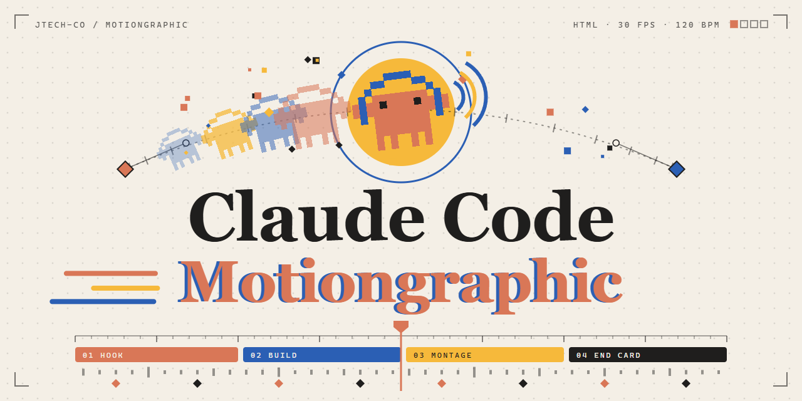

# Motion Graphic

HTML로 만든 데이터 모션그래픽 모음입니다.

작품마다 렌더 영상, 재생 페이지, 코드, 프롬프트를 여기서 바로 열어 볼 수 있습니다.

## 작품

### 1. SpaceX 2002—2026

1억 달러와 세 번의 실패로 시작한 회사가 로켓을 재사용해 세계 발사의 절반을 맡고, 2026년 Starship으로 궤도에 닿기까지.

25초 · 120 BPM · 1920×1080 · 30fps · 데이터 기준일 2026-09-29

[영상 (MP4)](1.%20SpaceX%20Motion/out/spacex-2002-2026.mp4) · [재생 페이지](1.%20SpaceX%20Motion/index.html) · [코드](1.%20SpaceX%20Motion/) · [프롬프트](1.%20SpaceX%20Motion/prompt/SpaceX%20Prompt.txt) · [스토리보드](1.%20SpaceX%20Motion/prompt/STORYBOARD.md) · [데이터셋](1.%20SpaceX%20Motion/dataset/SpaceX_Dataset_2002-2026.md)

### 2. Genesis 2015—2026

배지를 떼고 세단 세 대로 시작한 브랜드가 SUV로 판을 바꿔 연 20만 대를 넘기고, 10년 만에 150만 대를 판 뒤 르망과 GV90으로 향하기까지.

25초 · 120 BPM · 1920×1080 · 30fps · 데이터 기준일 2026-09-29

[영상 (MP4)](2.%20Genesis%20Motion/out/genesis-2015-2026.mp4) · [재생 페이지](2.%20Genesis%20Motion/index.html) · [코드](2.%20Genesis%20Motion/) · [프롬프트](2.%20Genesis%20Motion/prompt/Genesis%20Prompt.txt) · [스토리보드](2.%20Genesis%20Motion/prompt/STORYBOARD.md) · [데이터셋](2.%20Genesis%20Motion/dataset/genesis_brand_dataset.md)

### 3. DJI 2006—2026

선전에서 비행제어기 하나를 팔던 회사가 팬텀으로 하늘을 열고, 하늘에서 잡히는 드론 열에 여덟이 된 뒤, 손 안의 카메라까지 넘어오기까지.

25초 · 120 BPM · 1920×1080 · 30fps · 데이터 기준일 2026-09-29

[영상 (MP4)](3.%20DJI%20Motion/out/dji-2006-2026.mp4) · [재생 페이지](3.%20DJI%20Motion/index.html) · [코드](3.%20DJI%20Motion/) · [프롬프트](3.%20DJI%20Motion/prompt/DJI%20Prompt.txt) · [스토리보드](3.%20DJI%20Motion/prompt/STORYBOARD.md) · [데이터셋](3.%20DJI%20Motion/dataset/DJI_dataset_2006-2026.md)

### 4. Loopfield Studio

수식 한 줄이 빛의 무늬가 되고, 프리셋 32종과 레이어 4장을 거쳐 끝과 처음이 맞물린 4K 루프가 되기까지. 화면 속 패턴은 Loopfield 프리셋 GLSL을 영상 안에서 직접 렌더한 것입니다.

25초 · 120 BPM · 1920×1080 · 30fps · 데이터 스냅샷 2026-10-01

[영상 (MP4)](4.%20Loopfield-Studio%20Motion/out/loopfield-studio.mp4) · [재생 페이지](4.%20Loopfield-Studio%20Motion/index.html) · [코드](4.%20Loopfield-Studio%20Motion/) · [프롬프트](4.%20Loopfield-Studio%20Motion/prompt/Loopfield-Studio%20Prompt.txt) · [스토리보드](4.%20Loopfield-Studio%20Motion/prompt/STORYBOARD.md) · [데이터셋](4.%20Loopfield-Studio%20Motion/dataset/loopfield-studio-dataset.md)

재생 페이지는 GitHub Pages에서 열거나, 내려받은 뒤 `index.html`을 브라우저로 열면 됩니다.

## 템플릿 프롬프트

모든 작품은 [**Motion Graphic Template Prompt**](Motion%20Graphic%20Template%20Prompt.txt)에서 시작합니다. 주제, 데이터, 핵심 메시지, 길이, BPM 같은 빈칸을 채우면 한 작품의 프롬프트가 되고, 채운 프롬프트는 각 작품의 `prompt/` 폴더에 남겨 둡니다.

| 작품 | 채운 프롬프트 | 스토리보드 |
|---|---|---|
| SpaceX 2002—2026 | [SpaceX Prompt.txt](1.%20SpaceX%20Motion/prompt/SpaceX%20Prompt.txt) | [STORYBOARD.md](1.%20SpaceX%20Motion/prompt/STORYBOARD.md) |
| Genesis 2015—2026 | [Genesis Prompt.txt](2.%20Genesis%20Motion/prompt/Genesis%20Prompt.txt) | [STORYBOARD.md](2.%20Genesis%20Motion/prompt/STORYBOARD.md) |
| DJI 2006—2026 | [DJI Prompt.txt](3.%20DJI%20Motion/prompt/DJI%20Prompt.txt) | [STORYBOARD.md](3.%20DJI%20Motion/prompt/STORYBOARD.md) |
| Loopfield Studio | [Loopfield-Studio Prompt.txt](4.%20Loopfield-Studio%20Motion/prompt/Loopfield-Studio%20Prompt.txt) | [STORYBOARD.md](4.%20Loopfield-Studio%20Motion/prompt/STORYBOARD.md) |
